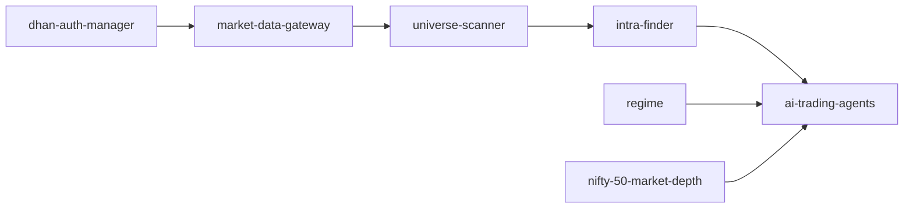

# Trading Pipeline Architecture

## What changed

The pipeline is separated by the kind of information each job uses:

1. **Universe Scanner** publishes every eligible ordinary equity plus optional historical profiles.
2. **Intra-Finder** watches the broad universe, ranks live activity cross-sectionally and detects named setups.
3. **AI trading agents** start immediately after a fresh deterministic setup trigger.

The old `sorting` process mixed historical scanning, live scanning, scheduling and
agent triggering. A failure in one responsibility could therefore affect all of
them. The new services can restart and report health independently.

Regime and NIFTY information are context for the agent. They do not silently
remove a stock-specific setup.

## Container responsibilities

| Container | Owns | Does not own |
|---|---|---|
| `dhan-auth-manager` | Scanner-token validation, renewal and TOTP recovery | Website-user OAuth tokens |
| `market-data-gateway` | REST rate limits, historical data and recovery quotes | Live WebSocket sorting |
| `universe-scanner` | Master validation, ASM/GSM exclusion, venue selection, profiles and corporate-action flags | Live opportunity filtering |
| `intra-finder` | Full Packet state, activity ranking, setup state machines and bounded event dispatch | Final trade decision or prediction of profitability |
| `nifty-50-market-depth` | NIFTY futures, options and deep-market context | Individual-stock qualification |
| `regime` | General market context | Blocking Intra-Finder events |
| `ai-trading-agents` | Final evidence/risk analysis and possible execution | Broad top-N scanning |

## Shared contracts

Every stock carries `isin`, `exchange_segment` and `security_id`. ISIN identifies
the security across exchanges. The segment and security ID identify the exact
venue used by Dhan. Downstream code must copy this identity; it must not infer
BSE or NSE from a symbol or number.

Critical snapshots are written to a temporary file and atomically renamed. A
reader therefore sees either the previous complete snapshot or the next complete
snapshot, never half-written JSON.

## Rollout safety

The requested small-capital environment starts Intra-Finder with
`INTRA_FINDER_SHADOW_MODE=0`. The shadow switch remains available. Agent work is
bounded by configuration, events expire, and live order placement stays
separately protected by `EXECUTIONER_ALLOW_LIVE_ORDERS`, the shared trade-slot
gate and fresh broker checks.

# Per-user trading amount (dynamic Stage 2 routing)

The Universe Scanner and Intra-Finder are continuous backend services. A website user does not start a scan. Stage 1 stays global and uses only historical/reference data. Intra-Finder also remains one global live detector.

After a global named setup passes the common safety gates, the agent gateway evaluates it separately for every configured user. The amount field is optional. When it is blank, the gateway fetches current available broker balance and uses that as the effective amount. When a user supplies an amount, that fresh positive value becomes the effective amount. The route uses broker margin plus the configured leverage cap to derive quantity; if the result is zero, that user is skipped while other users and global monitoring continue. Five-level depth and slippage are then estimated for that user's requested quantity. One user's rejection never removes the stock globally.

The effective amount is a strict cash/notional cap. Intraday margin data may be shown as evidence, but it cannot increase buying power. The mode, amount source, effective amount and requested quantity travel in the agent evidence packet. Current LTP is fetched again immediately before placement. Automatic mode also refreshes available balance; if either check no longer covers the requested notional, placement fails closed.

The current runtime represents multiple web-user configurations but uses one configured Dhan backend credential set. Per-user eligibility and evidence are isolated, but true per-user broker execution requires a credential resolver that creates a Dhan client for the routed `user_id`. Keep live orders disabled until that account isolation exists and is tested.
