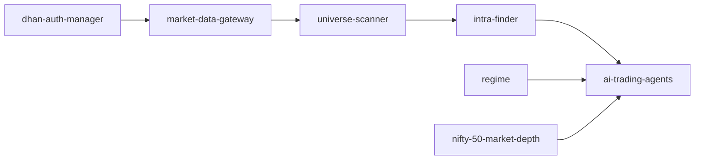

# Trading Pipeline Architecture

## What changed

The pipeline is separated by the kind of information each job uses:

1. **Universe Scanner** uses Dhan reference data and completed historical candles.
2. **Intra-Finder** watches the resulting stocks continuously with live Full Packet data.
3. **AI trading agents** start only after Intra-Finder confirms a setup.

The old `sorting` process mixed historical scanning, live scanning, scheduling and
agent triggering. A failure in one responsibility could therefore affect all of
them. The new services can restart and report health independently.

Regime and NIFTY information are context for the agent. They do not silently
remove a stock-specific setup.

## Container responsibilities

| Container | Owns | Does not own |
|---|---|---|
| `dhan-auth-manager` | Scanner-token validation, renewal and TOTP recovery | Website-user OAuth tokens |
| `market-data-gateway` | REST rate limits, historical data and recovery quotes | Live WebSocket sorting |
| `universe-scanner` | Master validation, ASM/GSM exclusion, historical filters and venue selection | Live prices |
| `intra-finder` | Full Packet capture, five-level depth, ORB/VWAP detection and event dispatch | Final trade decision |
| `nifty-50-market-depth` | NIFTY futures, options and deep-market context | Individual-stock qualification |
| `regime` | General market context | Blocking Intra-Finder events |
| `ai-trading-agents` | Final evidence/risk analysis and possible execution | Broad top-N scanning |

## Shared contracts

Every stock carries `isin`, `exchange_segment` and `security_id`. ISIN identifies
the security across exchanges. The segment and security ID identify the exact
venue used by Dhan. Downstream code must copy this identity; it must not infer
BSE or NSE from a symbol or number.

Critical snapshots are written to a temporary file and atomically renamed. A
reader therefore sees either the previous complete snapshot or the next complete
snapshot, never half-written JSON.

## Rollout safety

Intra-Finder defaults to `INTRA_FINDER_SHADOW_MODE=1`. It records setup events
without calling an agent. Replay the captured data and review events before
setting the value to `0`. Live order placement remains separately protected by
`EXECUTIONER_ALLOW_LIVE_ORDERS`.
