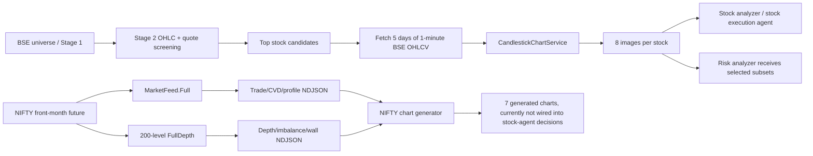
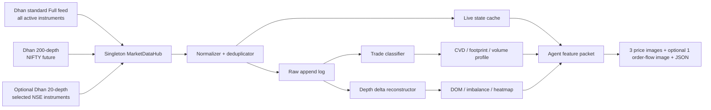

# Chart, Order-Flow, and Dhan Data Audit

Date: 2026-07-29  
Scope: BSE equity stock-agent charts, NIFTY futures depth/order-flow recorder, Dhan v2 data capabilities, and the supplied chart-redesign recommendation.

## Executive conclusion

The immediate problem is not just chart clutter. Some panels are visually misleading, and two order-flow calculations are not safe enough to use as trading evidence.

The recommended direction is:

1. Reduce the normal stock-agent input from eight four-panel images to three purpose-built price images, with a fourth order-flow image only when valid live order-flow coverage exists.
2. Remove the existing stock-chart CVD immediately. It is candle-direction volume, not CVD.
3. Fix the one-minute price viewport so distant previous-day levels and zones cannot flatten the candles.
4. Fix the NIFTY tick deduplication before trusting its CVD, footprint, or volume profile.
5. Keep Dhan market-data connections behind one central collector. Record live data from market open because Dhan does not provide historical order-book or trade-side data.
6. Treat deep DOM and heatmaps as NSE-only with Dhan. The current stock workflow is hard-coded to BSE, where Dhan's 20/200-depth feed is not available.
7. Send agents structured numerical features alongside a small number of charts. More chart tabs are useful for a human terminal, but more images are not automatically better for an LLM.

## Implementation status after the audit

The following corrections are now implemented:

- active Stock Agent bundles contain `current_1m`, `current_5m`,
  `current_15m`, and one `previous_15m` context chart;
- stock candle images are price-only, use visible-candle y-scaling, show off-screen
  prior-day levels without expanding the viewport, and draw candles above EMA/VWAP;
- the candle-direction stock CVD and `cvd_direction` metadata were removed;
- the active combined Stock Agent is told the exact four-image decision-role order;
- Stage-2 RVOL, opening-range, VWAP-distance, volume-acceleration, liquidity,
  and data-quality fields are exposed through its market-data tool;
- NIFTY trade packets with a known zero cumulative-volume delta are dropped instead
  of being recounted from LTQ;
- NIFTY CVD and volume profile are rebuilt from deduplicated trade rows;
- the 200-depth heatmap uses a synchronized IST time window and a time-by-price matrix;
- large-order events require persistent appearance/removal across multiple depth updates;
- large NDJSON tails are read from the end of the file and depth snapshots are binned
  before expansion;
- `tzdata` is included for slim-container timezone reliability.

The larger storage migration, central WebSocket connection registry, reconnect
conservation accounting, and decision-agent integration of NIFTY artifacts remain
future work.

## Instrument-capacity decision for this pipeline

| Data contract | Dhan capacity | Correct use in this project |
|---|---:|---|
| Historical OHLCV | 5 data requests/second, 100,000/day | Stage 1/2 scans and stock price charts |
| Live quote REST | 1 request/second, up to 1,000 instruments/request | Batched Stage 2 quote/liquidity snapshots |
| Standard WebSocket Full packet | Up to 5,000 instruments/connection; 5 user connections | Broad live shortlist/tick collection when needed |
| 20-level full depth | Up to 50 NSE instruments/connection | Optional later NSE shortlist, not BSE candidates |
| 200-level full depth | Exactly 1 NSE instrument/connection | Reserve for front-month NIFTY future |

The Stage 2 top 30 cannot receive 200-depth simultaneously: it would need 30
dedicated full-depth connections, while Dhan allows one instrument on each
200-depth connection and the account connection budget is far smaller. It also
cannot be chosen at 09:15 because the Stage 2 membership is produced later by
sorting. Therefore the production split is deliberate:

- **stock pipeline:** historical OHLCV plus batched live quote/5-level data;
- **NIFTY monitoring:** record one front-month NIFTY futures 200-depth book and
  synchronized Full trade packets continuously from market open.

## Current architecture



### Stock chart path

- `run_stock_agent.py` fetches five days of 1-minute history with `exchange_segment="BSE_EQ"`.
- `CandlestickChartService` generates current-day 1m, 5m, 15m, 30m, and 1h charts, plus previous-day 5m, 15m, and 1h charts.
- Every image repeats price, volume, RSI, and a CVD proxy.
- `chart_paths_ordered` sends all eight images to the stock agent.
- The older stock analyzer also sends all eight images. The risk analyzer selects three images per stock.

This produces substantial duplicate visual evidence: 8 images × 4 panels = 32 panels per stock before any tool calls.

### NIFTY order-flow path

- `NiftyDepthMonitor` correctly uses the tradeable front-month NIFTY futures contract rather than the cash index for order-book data.
- One Dhan standard Full feed records LTP, LTQ, cumulative volume, OI, and five-level depth.
- One Dhan 200-depth connection records bid and ask snapshots.
- A separate Full feed records nearby options.
- Derived files include trade ticks, CVD, depth imbalance, large-order events, volume profile, and chart artifacts.
- These NIFTY artifacts are generated, but repository search found no decision agent consuming `nifty_market_depth_charts_latest.json`.

## Findings in the supplied stock charts

### 1. The one-minute candles are flattened by the y-axis policy

The renderer first takes visible candle high/low, then expands the same price axis to include:

- every pivot support/resistance;
- every detected supply/demand zone;
- PDH, PDL, and PDC.

In the supplied one-minute Swiggy chart, current price is around ₹267 while PDL is around ₹253. Including that distant level forces roughly ₹14 of range onto the price axis, even though the recent candles occupy only about ₹1–₹2. The candles therefore use a small fraction of the vertical pixels.

This is the primary cause of the compression. Merely increasing figure height will not solve it.

Required behavior:

- Determine the one-minute y-range only from the visible candle window.
- Add robust padding, such as `max(0.35 × ATR(14), 4% of visible high-low range, 2 ticks)`.
- Do not expand the viewport for distant levels.
- Clip zones to the viewport.
- Represent an off-screen PDH/PDL/PDC or zone in a right-side rail with an arrow and distance, for example `PDL 253.0 ↓ 5.3%`.

### 2. EMA and VWAP are explicitly drawn above the candles

The renderer uses:

- wicks at z-order 3;
- candle bodies at z-order 4;
- EMA lines at z-order 5;
- VWAP at z-order 6.

The user's observation is correct: the lines are designed to cover the candles. On a compressed one-minute chart this obscures bodies and wicks.

Required behavior:

- Draw zones and bands at the bottom.
- Draw EMA/VWAP under candle bodies, with lower alpha and thinner lines on 1m.
- Draw wicks and bodies above the indicators.
- Preserve a high-contrast candle edge.

### 3. The stock-chart “CVD” is not CVD

The code assigns:

```text
green candle -> +100% of candle volume
red candle   -> -100% of candle volume
```

and cumulatively sums that value.

True CVD requires executed volume split by aggressor side—volume transacted at/through the ask versus volume transacted at/through the bid. Candle color cannot provide that information. A green candle can contain net aggressive selling, and a red candle can contain net aggressive buying.

The prompt does disclose that this is approximate, but the image and metadata still call it `CVD` and `cvd_direction`. The large red filled blocks in the supplied images are a visual symptom of this invalid proxy.

Action: remove this panel and remove `cvd_direction` from stock technical metadata. Do not rename it “estimated CVD.” If retained for research, call it `signed_candle_volume_proxy` and never use it as order-flow evidence.

### 4. Chart count and repeated panels dilute the evidence

The current chart set is:

- current: 1m, 5m, 15m, 30m, 1h;
- previous: 5m, 15m, 1h.

All eight repeat the same four panels. Previous-day levels are already overlaid on current charts, so three previous-day images add less value than their image/context cost suggests. The 30m and 1h intraday charts also contain very few candles and unstable short-period indicators.

Recommended agent chart bundle:

1. `execution_1m_price.png`: recent 60–90 minutes.
2. `setup_5m_price.png`: current session to now.
3. `structure_15m_price.png`: current session plus compact prior-session context.
4. `orderflow_1m.png`: optional and only attached when live coverage/quality passes.

RSI, ATR, relative volume, level distances, and detected patterns should normally be structured JSON fields, not repeated pixels.

### 5. The one-minute pattern positions can be wrong

Pattern indices are calculated on the full one-minute session. The renderer then slices the frame to the last 120 candles without rebasing those indices. A recent pattern with an original index above 119 is skipped; an older pattern with a smaller index can be drawn at the wrong candle in the sliced view.

Action: carry timestamps as pattern identifiers and join them to the sliced frame. Never use pre-slice integer positions.

### 6. Volume outliers destroy the volume scale

The supplied 5m/15m charts contain very large single bars that flatten all normal bars. A dedicated volume chart should use one of:

- robust y-limit with outlier cap and an explicit clipped-value label;
- `sqrt(volume)` display transform;
- separate “spike ratio” labels while keeping raw volume in metadata.

Do not silently use a log scale without labeling it.

### 7. Empty future-session space is wasted in agent images

Non-1m charts extend the x-axis to 15:30 even when data ends earlier. A small right margin is useful for labels; a large empty region is not useful to an image model.

Action: end at the latest completed candle plus two or three bars of padding. Put `minutes_to_close` in structured metadata.

### 8. Supply/demand and pattern labels are overstated

The supply/demand implementation is a simple three-candle base plus large-body heuristic. It does not validate:

- base compression quality;
- departure volume;
- freshness or number of retests;
- partial/full mitigation;
- time decay;
- higher-timeframe confluence.

These are “heuristic candidate zones,” not evidence of institutional orders.

The candlestick labels are also deterministic shape detections without location/follow-through confidence. Moving them out of the main chart is sensible, but a value such as “Confidence 84%” must not be invented. Confidence requires calibration against labeled out-of-sample results.

## The correct chart contract for an agent

The supplied AI recommendation is broadly correct for a human terminal, but an agent should not receive seven or eight separate pages by default. The better contract is a small evidence dossier.

### Image 1: one-minute execution price

Purpose: entry timing.

Show:

- last 60–90 completed 1m candles plus the current partial candle, visibly marked as partial;
- EMA9, EMA21, and session VWAP;
- current-price line and label;
- nearest one support and one resistance/zone only;
- nearest PDH/PDL/PDC only when inside the viewport;
- session high/low or opening-range levels only when relevant.

Do not show:

- RSI;
- volume;
- CVD proxy;
- Bollinger fill by default;
- pattern labels;
- distant levels that change the y-range.

Rendering rules:

- 16:9 price-only canvas;
- candles above overlays;
- y-axis based on visible price only;
- no more than four colored overlays;
- explicit `PARTIAL` label for an incomplete candle;
- exact `data through HH:MM:SS IST`.

### Image 2: five-minute setup price

Purpose: determine whether the setup is breakout, pullback, reversal, or range.

Show:

- current-session candles to now;
- EMA9/EMA21/VWAP;
- opening range;
- current price;
- nearest meaningful levels;
- optional Bollinger bands only when squeeze/expansion is a feature.

### Image 3: fifteen-minute structure

Purpose: trend and trade location.

Show:

- enough history to include the prior session and current session;
- PDH/PDL/PDC;
- session separation;
- a small number of validated swing levels.

Do not calculate RSI(14) on only a handful of current-day 15m candles and present it as mature without a warm-up history.

### Structured feature packet

Send exact values in JSON:

```json
{
  "as_of_ist": "...",
  "coverage": {
    "price_start_ist": "...",
    "orderflow_start_ist": null,
    "is_current_candle_complete": false
  },
  "price": {
    "last": 0,
    "ema9": 0,
    "ema21": 0,
    "vwap": 0,
    "atr14": 0,
    "rsi14": 0,
    "distance_to_vwap_atr": 0
  },
  "levels": [
    {"kind": "PDH", "price": 0, "distance_atr": 0, "visible": true}
  ],
  "volume": {
    "last_bar": 0,
    "average_same_time_20d": 0,
    "relative_volume": 0,
    "spike_zscore": 0
  },
  "orderflow": {
    "available": false,
    "quality": "unavailable",
    "reason": "collector_started_after_open"
  },
  "data_quality": {
    "source": "dhan_historical_ohlcv",
    "gaps": 0,
    "staleness_seconds": 0
  }
}
```

The agent should reason from exact fields and use images mainly for geometric context.

## Dhan feasibility matrix

The findings below were verified against Dhan's current official v2 documentation:

- [Live Market Feed](https://dhanhq.co/docs/v2/live-market-feed/)
- [Full Market Depth](https://dhanhq.co/docs/v2/full-market-depth/)
- [Historical Data](https://dhanhq.co/docs/v2/historical-data/)
- [Market Quote](https://dhanhq.co/docs/v2/market-quote/)
- [Option Chain](https://dhanhq.co/docs/v2/option-chain/)
- [Dhan v2 releases](https://dhanhq.co/docs/v2/releases/)
- [Official Python SDK](https://github.com/dhan-oss/DhanHQ-py)

| Requested feature | Possible now? | Accuracy and source | Important limitation |
|---|---:|---|---|
| Candle volume chart | Yes | Exact Dhan historical OHLCV candle volume | No buy/sell split |
| Relative volume / volume spike | Yes | Historical OHLCV plus same-time baseline | Baseline must avoid look-ahead and partial-bar bias |
| Live 5-level DOM | Yes | Standard Full WebSocket or quote snapshot | Historical DOM is unavailable unless recorded locally |
| 20-level DOM | Yes, NSE only | Dhan Full Market Depth WebSocket | Up to 50 instruments per connection; consumes a WebSocket connection |
| 200-level DOM | Yes, NSE only | Dhan Full Market Depth WebSocket | One instrument per connection |
| BSE 20/200-depth | No through Dhan full-depth | Not supported by the official full-depth endpoint | Current stock universe is BSE |
| Order-book imbalance | Yes, live | `(bid_qty - ask_qty)/(bid_qty + ask_qty)` at chosen depth bands | Must state band (top 1/5/20/200); resting orders can cancel |
| Trade bid/ask imbalance | Approximate | Infer aggressor from LTP versus contemporaneous BBO, then tick rule | Dhan does not send an explicit aggressor flag |
| CVD | Approximate live; not from historical candles | Cumulative inferred aggressive-buy minus aggressive-sell volume | Must record from market open; cannot reconstruct accurately from OHLCV |
| Footprint | Approximate live | Aggregate inferred trade side by candle and price bin | Not exchange-grade; no historical reconstruction from Dhan candles |
| Time & Sales / tape | Approximate | LTP, LTQ, LTT from Full feed | No exchange trade ID or participant identity is documented |
| Volume profile | Yes | Best from recorded trade volume by price; rough proxy from OHLCV | Candle-based distribution is not exact volume-at-price |
| Market Profile / TPO | Yes | Derive time-at-price brackets from 1m ranges or recorded ticks | TPO is time-at-price, not volume profile |
| Liquidity heatmap | Yes for recorded live depth | Persist 5/20/200-level book states over time | No Dhan historical depth backfill |
| Absorption/exhaustion | Heuristic | Trades at a level plus persistent/reloading depth | Requires high-quality synchronized trade/depth history |
| Iceberg detection | Hypothesis only | Replenishment at a price despite executions | Aggregated depth has no hidden quantity/order identity |
| Spoofing detection | Hypothesis only | Repeated add/cancel behavior away from touch | Cannot reliably establish intent from aggregated public depth |
| Institutional orders | No reliable identification | Large print/order can be flagged | Size does not identify institution or beneficial owner |
| Block trades | Large-print alert only | Flag LTQ above threshold | Do not label as an official block trade without a dedicated flag/source |
| Options OI/PCR/IV/Greeks | Yes | Dhan option-chain API | Option-chain rate is one unique request per three seconds |
| Dealer gamma exposure | Model estimate only | Requires OI, Greeks, contract multiplier, and dealer-position assumptions | Dealer long/short positioning is not provided |

### Dhan limits that shape the design

- Standard live feed: up to five WebSocket connections per user, up to 5,000 subscribed instruments per connection, and at most 100 instruments per subscription message.
- Standard Full packets contain LTP, LTQ, LTT, cumulative volume, total buy/sell quantity, OI for derivatives, OHLC, and five depth levels.
- Full-depth 20/200 is limited to NSE equity and derivatives.
- 20-depth supports up to 50 instruments per connection.
- 200-depth supports one instrument per connection.
- Historical intraday data provides OHLC, volume, and optional OI—not individual trades, aggressor side, or order-book history.
- Historical minute intervals are 1, 5, 15, 25, and 60. A 30m chart must be resampled locally.
- Historical requests can cover at most 90 days per request for intraday data.
- Market quote REST is a live snapshot endpoint, up to 1,000 instruments per request at one request per second.

Connection capacity is shared. “Five 200-depth instruments” or “250 20-depth instruments” is only a theoretical maximum when all five user connections are dedicated to that feed and nothing else uses them.

## Critical audit of the NIFTY recorder

### What is good

- It records NIFTY futures, not the non-tradeable cash index, for depth.
- The futures segment mapping is `NSE_FNO`.
- Real 200-level price, quantity, and order-count data is being persisted.
- It stores receive time, monotonic time, and a per-stream event sequence.
- It captures a standard Full packet alongside deep depth, enabling trade/depth inference.
- It labels the footprint as an approximation in the chart manifest.

### What is currently unsafe

#### Duplicate trade volume is counted

Observed consecutive records include identical LTP, LTT, and cumulative volume, followed by `volume_delta: 0`. The recorder is configured with `persist_every_packet=true`, so duplicate full packets are written.

Both monitor and chart-loader logic then do this:

```text
if volume_delta is positive:
    use volume_delta
else:
    use last_traded_quantity
```

Therefore an unchanged packet with `volume_delta = 0` is counted again using LTQ. This inflates:

- cumulative buy/sell volume;
- CVD;
- footprint cells;
- volume profile;
- trade bubbles.

Required correction:

1. A packet with unchanged cumulative volume is not a new traded-volume event; skip it.
2. Use `volume_delta` as the conserved quantity when available.
3. Use LTQ only when cumulative volume is unavailable and the trade fingerprint changed.
4. Deduplicate on at least `(security_id, LTT, LTP, cumulative_volume)`.
5. On reconnect/session reset, start a new baseline rather than treating the whole cumulative volume as one trade.
6. Assert that `buy + sell + neutral` over a period does not exceed observed cumulative-volume growth, except for a documented reset/gap adjustment.

Until this is fixed and replay-tested, the NIFTY CVD, footprint, and profile must be marked `invalid_for_decisions`.

#### The heatmap is not a time-continuous heatmap

The chart defaults to a tail sample:

- depth: last 700 packets;
- trades: last 1,800 rows.

These samples can cover different time spans. The resulting image shows session trade bubbles across a wider period while depth appears as a narrow vertical block near the end. Scatter points also show snapshots rather than persistence between updates.

Required correction:

- Query a common explicit time window for depth and trades.
- Reconstruct quantity persistence as a time × price matrix.
- Forward-fill a level only until the next book update, with a maximum stale duration.
- Render with `pcolormesh`/image tiles, not independent scatter points.
- Provide selectable windows such as last 15m, last 60m, and session.

#### Chart times are displayed in UTC while labeled generically as time

NDJSON timestamps are parsed with `utc=True`, and Matplotlib's `DateFormatter("%H:%M")` is used without an IST timezone. The observed chart shows approximately 09:xx when the corresponding captured data is approximately 14:xx IST.

Required correction:

- Standardize configuration on `Asia/Kolkata`.
- Add the Python `tzdata` package to the slim Docker image/requirements.
- Convert frames to IST before bucketing and plotting.
- Pass timezone explicitly to date formatters.
- Add an automated assertion that the plotted last label agrees with LTT/IST.

The existing option-chain chart failure—`ZoneInfoNotFoundError: Asia/Calcutta`—is another symptom of missing timezone data in the slim container.

#### Large-order event generation is explosive

Observed data for one session contains approximately:

- `depth_200.ndjson`: 784 MB;
- `large_order_events.ndjson`: 369 MB;
- `options_feed.ndjson`: 70 MB;
- total observed files: about 1.25 GB;
- large-order events: about 959,000 rows.

This is not a sustainable “wall event” stream. Normal full-book changes are being converted into huge numbers of appear/remove events.

Required correction:

- Define wall size relative to rolling depth at nearby prices, not a fixed quantity alone.
- Require persistence for N updates or T milliseconds before emitting “appeared.”
- Emit material quantity changes, not every transition.
- Add cooldown/hysteresis keyed by instrument, side, and price.
- Store periodic full snapshots plus book deltas, not repeated full 200-level JSON snapshots forever.
- Partition compressed columnar storage by market date, instrument, and event type.

#### Bid/ask side naming in local documentation is inconsistent

Dhan's official depth documentation uses response code 41 for bid/buy and 51 for ask/sell. Some local prose says “bid (sell)” and “ask (buy),” which is reversed/confusing.

Canonical naming should be:

- bid = resting buy;
- ask/offer = resting sell;
- aggressive buy = execution at/through ask;
- aggressive sell = execution at/through bid.

### Quality grades are mandatory

Every derived order-flow artifact should carry:

```json
{
  "quality": "exact_depth|inferred_trade_side|proxy|unavailable",
  "coverage_start_ist": "...",
  "coverage_end_ist": "...",
  "collector_started_after_open": false,
  "duplicate_packets_dropped": 0,
  "sequence_gaps": 0,
  "neutral_volume_percent": 0,
  "classified_volume": 0,
  "observed_exchange_volume_delta": 0,
  "conservation_error_percent": 0
}
```

The agent must be instructed to ignore order flow when quality fails.

## Validation of the supplied AI recommendation

### Correct recommendations

- Separate charts by purpose.
- Keep the price chart clean.
- Remove RSI and CVD from the default price canvas.
- Move pattern detections to structured signals or an optional layer.
- Build dedicated volume, order-flow, liquidity, and profile views.
- Use toggles/layers for a human terminal.
- Keep ATR as a compact numerical field rather than a panel.

### Recommendations that need correction

- “What are institutions doing?” cannot be answered directly by DOM/tape. The data shows public orders and executions, not participant identity.
- Iceberg and spoofing “detection” must be described as heuristic alerts, not facts.
- Smart-money concepts such as order blocks, FVG, BOS, and CHOCH are derived price-pattern taxonomies. They do not prove what institutions are doing.
- A separate page for every indicator is unnecessary for an agent. Numeric features are more precise and cheaper than images.
- `Confidence 84%` for a pattern is invalid unless produced by a calibrated model with out-of-sample reliability evidence.
- Bollinger Bands should be off by default on the one-minute execution chart; they add another layer over already compressed candles.
- CVD is not useful merely because it has more vertical space. It becomes useful only after its input data is valid.
- Seven or eight default tabs may be acceptable in an interactive terminal, but sending all of them to an LLM repeats evidence and can reduce decision clarity.

## Recommended market-data architecture



### Connection plan

Centralize ownership instead of allowing separate containers to create Dhan sockets independently.

A practical allocation:

1. One standard Full feed for NIFTY futures, nearby options, and the active BSE shortlist. A single standard connection supports far more instruments than this system needs.
2. One 200-depth connection for NIFTY futures.
3. Optionally, one 20-depth connection for selected NSE instruments.
4. Keep two connections spare for reconnect overlap, experiments, or future feeds.

The exact number must be managed by a connection registry because Dhan disconnects the first connection when a sixth connection is opened.

### Storage model

For the current scale, begin with partitioned Parquet plus a small SQLite/Postgres manifest, or use ClickHouse if low-latency historical queries are required.

Do not continue with unbounded repeated JSON full snapshots as the long-term store.

Suggested logical tables:

- `trade_events`: instrument, exchange time, receive time, LTP, volume delta, BBO, inferred side, method, quality.
- `depth_snapshots`: periodic complete baseline.
- `depth_deltas`: changed level quantities between baselines.
- `bars_1m`: canonical OHLCV and completeness flag.
- `derived_orderflow_1m`: buy, sell, neutral, delta, CVD, imbalance count, quality.
- `volume_profile_session`: price bin, total, inferred buy/sell, quality.
- `data_quality`: gaps, duplicates, resets, coverage, conservation.

## Implementation order

### Phase 0: stop misleading evidence

1. Remove the stock CVD panel and `cvd_direction`.
2. Stop attaching all eight stock images. Use current 1m, 5m, and 15m only.
3. Mark current NIFTY CVD/footprint/profile invalid for trading decisions.
4. Update prompts so agents cannot interpret the removed proxy as real flow.

### Phase 1: rebuild the price chart contract

1. Split rendering into explicit chart roles rather than one universal four-panel renderer.
2. Implement viewport-only y-scaling and off-screen level labels.
3. Put candles above EMA/VWAP.
4. Add current-price line, partial-candle marker, and data-age label.
5. Fix one-minute pattern timestamp alignment.
6. Remove future-session whitespace.
7. Add `tzdata`, use `Asia/Kolkata`, and test chart timestamps.
8. Move patterns, RSI, ATR, and full level lists to JSON.

### Phase 2: correct the live trade recorder

1. Centralize WebSocket ownership.
2. Deduplicate full packets.
3. Use cumulative-volume changes as the primary executed quantity.
4. Implement reconnect/session-reset handling.
5. Classify aggressor side with contemporaneous BBO and a tick-rule fallback.
6. Record quality metrics and enforce volume conservation.
7. Build a deterministic replay test from the already captured NDJSON.

### Phase 3: build trustworthy participation charts

1. Dedicated volume/RVOL chart from exact OHLCV.
2. TPO market profile from time-at-price.
3. Volume profile from corrected trade events; clearly label candle-based fallback as approximate.
4. Corrected CVD and delta histogram.
5. Corrected footprint with price-bin and imbalance rules.

### Phase 4: rebuild liquidity views

1. DOM snapshot with top N levels, cumulative depth, spread, and age.
2. Order-book imbalance at named bands: top 1, top 5, top 20, and near-price notional.
3. True time-persistent heatmap using synchronized windows.
4. Wall/replenishment/cancellation alerts with persistence and relative thresholds.
5. Never label spoofing, iceberg, or institutional activity as confirmed.

### Phase 5: agent integration and evaluation

1. Attach order-flow evidence only when its coverage and quality pass.
2. Prefer structured features over image labels.
3. Run offline replay evaluations against future returns, slippage, and false positives.
4. Compare three-image versus eight-image agent performance.
5. Calibrate any signal confidence before displaying percentages.

## Acceptance tests

### Price charts

- Distant PDH/PDL/PDC never changes the visible-candle y-range.
- At least 80% of the price-panel height is available to visible price plus padding.
- Median one-minute candle body/wick remains visually distinguishable at final image resolution.
- Candles render above EMA/VWAP.
- Latest chart time equals the latest candle time in IST.
- Partial candles are labeled.
- Pattern markers resolve by timestamp after slicing.

### Order flow

- Duplicate full packets produce zero additional trade volume.
- Sum of buy, sell, and neutral volume matches cumulative exchange-volume growth within a stated tolerance.
- Reconnects do not create artificial volume spikes.
- No CVD is emitted when coverage or conservation fails.
- Footprint totals equal corrected classified-volume totals for the same window.
- Neutral volume percentage is surfaced.

### Depth and heatmap

- Bid/ask sides match official Dhan response semantics.
- All views use the same explicit time window.
- A depth level persists only until its next update or stale timeout.
- Full snapshot plus deltas reproduces the final DOM exactly.
- Storage growth is measured and bounded.

### Agent evaluation

- The agent can identify latest price, nearest level, trend, and invalidation from the three-image packet.
- Removing five redundant images does not reduce decision accuracy in replay.
- Invalid/proxy order flow cannot be cited as exact evidence.
- Every recommendation records source timestamps and data quality.

## Files most relevant to implementation

- `python-backend/pipeline/services/charting_service.py`
- `python-backend/pipeline/runtime/run_stock_agent.py`
- `python-backend/pipeline/runtime/run_stock_analyzer.py`
- `python-backend/pipeline/analyzer/stock_analyzer_agent.py`
- `python-backend/pipeline/stock/stock_agent.py`
- `python-backend/pipeline/runtime/run_risk_analyzer.py`
- `python-backend/pipeline/services/dhan_service.py`
- `python-backend/pipeline/services/nifty_depth_monitor.py`
- `python-backend/pipeline/services/nifty_depth_charting.py`
- `python-backend/pipeline/runtime/run_monitor_loop.py`
- `python-backend/pipeline/runtime/run_tick_collector.py`
- `python-backend/pipeline/config.py`
- `docker-compose.yml`
- `requirements.txt`

## Final decision

Do the price-chart cleanup first. It is low risk, immediately improves agent perception, and removes a false CVD signal.

Then repair and validate the recorder before adding more order-flow images. The project already contains most of the scaffolding needed for NIFTY DOM, CVD, footprint, heatmap, and volume profile, but the current derived volume is double-counted and the heatmap/timezone rendering is incorrect. Those are data-integrity issues, not cosmetic issues.

For the BSE stock agents, exact candle volume, RVOL, TPO, and clean price charts are available now. Five-level live DOM and approximate live trade flow are feasible if a shortlist Full-feed collector runs from market open. Deep 20/200-level DOM for those BSE stocks is not available through Dhan. If deep stock-level order flow is a firm requirement, either move that component to NSE-listed instruments or procure a different licensed data source that explicitly supports BSE deep depth and historical tick/order-book data.
