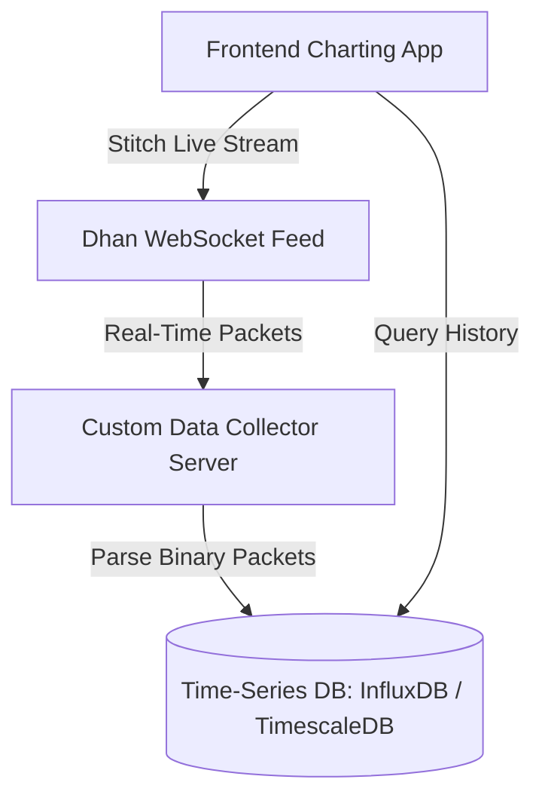

# Comprehensive Guide: Market Depth, Liquidity Heatmaps, and Order Flow Charts

This document provides a highly detailed summary of our discussion regarding **Market Depth**, **Order Book Heatmaps (Liquidity Heatmaps)**, and **Order Flow Candle Charts (Footprint Charts)**, including the implementation mechanics and the specific data constraints/limits imposed by the **Dhan API**.

---

## 1. What is Market Depth?

**Market Depth** (also known as the **Order Book**) represents the list of pending, unexecuted limit orders resting at the exchange at any given moment. It is organized into two sections:
*   **Bids (Buy Orders):** Stacks of orders at prices lower than or equal to the current market price, waiting to buy.
*   **Asks/Offers (Sell Orders):** Stacks of orders at prices higher than or equal to the current market price, waiting to sell.

For each price level in the market depth, the data package returns:
1.  **Price:** The specific price level where orders are resting.
2.  **Quantity/Volume:** The total number of shares/contracts waiting to be filled at that price.
3.  **Number of Orders:** The count of individual order tickets placed at that price.

---

## 2. 20-Level vs. 200-Level Market Depth (The Differences)

Exchanges classify market depth based on the number of price steps (levels) sent to the client:

| Feature | Level 2 Depth (5-Level) | Level 3 Depth (20-Level) | Full Depth (200-Level) |
| :--- | :--- | :--- | :--- |
| **Number of Levels** | 5 bids and 5 asks | 20 bids and 20 asks | 200 bids and 200 asks |
| **Dhan Endpoint** | Live Market Feed (Standard) | `wss://depth-api-feed.dhan.co/twentydepth` | `wss://full-depth-api.dhan.co/twohundreddepth` |
| **Instruments/Conn** | Up to 5,000 instruments | Up to 50 instruments | **Exactly 1 instrument** |
| **Maximum Stocks** | ~25,000 (across 5 connections) | 250 (across 5 connections) | **Exactly 5 stocks** (across 5 connections) |
| **Packet Size** | Small (100-byte structure) | Medium (320 bytes per side) | Large (3200 bytes per side) |
| **Main Use Case** | Spread calculation, basic execution | Medium-range supply/demand zones | Deep liquidity detection, institutional spoofing detection |

### Are We Using This Data in Our Trading Agentic System?
*   **In Architecture/Design:** Yes, the theoretical system design references using Level 2 Market Depth (top 5 bids/asks) as features for evaluating short-term price imbalances (e.g., detecting if 65% of the depth is stacked on the bids).
*   **In Current Codebase Implementation:** In [dhan-data-api-test.py](file:///c:/Users/prajw/Downloads/Trader/python-backend/dhan-data-api-test.py#L121-L176), we have successfully implemented and tested dedicated WebSocket client logic for parsing binary packets from both `20-level` and `200-level` Dhan depth feeds using the `FullDepth` SDK module.
*   **In Live Production Loops:** Due to Dhan's limit of **5 simultaneous WebSocket connections** (which restricts 200-level depth to just 5 stocks total), the live execution agent primarily relies on real-time quotes/LTP or 5-level feeds for the broader universe, while reserving the deep 200-level connections for specific high-priority watchlist stocks.

---

## 3. The Temporal Behavior of Market Depth Data (Real-time vs. Historical)

A common misconception is that market depth can be requested historically. 

> [!IMPORTANT]
> **Market Depth is strictly LIVE (Real-Time). There is NO historical API for order book depth.**

If you connect to the Dhan 200-level WebSocket at **12:00 PM**:
1.  **Initial Snapshot:** You will instantly receive a single packet containing the current order book depth at exactly 12:00 PM.
2.  **Streaming Updates:** From 12:00 PM onwards, you will receive real-time updates as orders are added, cancelled, or executed.
3.  **Historical Depth:** You **cannot** get the market depth state from 9:30 AM to 12:00 PM, nor can you fetch the previous day's market depth via an API call. 

If you want historical market depth to analyze later, your system **must be running live during market hours to record the data yourself**.

---

## 4. Constructing Heatmaps and Order Flow Charts

To create advanced visual charting systems like **Liquidity Heatmaps** or **Order Flow Candle (Footprint) Charts**, you must set up a custom data-collection pipeline.



### A. Order Book Heatmap (Liquidity Heatmap)
A heatmap displays resting order sizes at different price levels over time, with colors denoting order density (similar to a weather radar).
*   **Data Required:** 20 or 200-level market depth (price + quantity).
*   **How to Build It:** 
    1.  Connect to the WebSocket at market open (9:15 AM).
    2.  Write the entire depth snapshot to a database every $X$ seconds/milliseconds (or on every tick).
    3.  When rendering, plot a 2D grid: the $x$-axis represents Time, the $y$-axis represents Price, and the color brightness represents Quantity.

### B. Order Flow Candle Chart (Footprint Chart)
A footprint chart reveals the volume traded *inside* each candle at specific price levels, splitting transactions by who initiated them (aggressive buyers vs. aggressive sellers).
*   **Data Required:** Real-time Trade Ticks (LTP + Quantity + Timestamp) plus the best Bid/Ask price at the millisecond of the trade.
*   **How to Build It:**
    1.  Capture every trade tick.
    2.  If the trade price $\ge$ Ask, classify it as a **Buyer-Initiated (Aggressive Buy)** trade.
    3.  If the trade price $\le$ Bid, classify it as a **Seller-Initiated (Aggressive Sell)** trade.
    4.  Aggregate these volumes on a grid for each price level within the duration of a candle (e.g., 5-minute candle).

### The Recorder-Stitcher Pattern
To load these charts without lagging:
1.  **Data Collector:** A background Python service runs continuously from 9:15 AM to 3:30 PM, saving every WebSocket packet into a time-series database (e.g., ClickHouse, InfluxDB, or TimescaleDB).
2.  **Stitcher (UI):** When you open your web app at 12:00 PM:
    *   The app queries your **own database** for historical depth/trade snapshots from 9:30 AM to 12:00 PM.
    *   It then connects directly to the **live WebSocket feed** to append new ticks to the screen in real-time.

---

## 5. Dhan API Rate Limits & Instrument Tracking Capacity

Dhan enforces strict rules on connection limits and message structures. If you exceed these, your connections will be disconnected.

### Connection Thresholds
*   **Max Connections:** You are allowed a maximum of **5 concurrent WebSocket connections** across all tokens.
*   **Force Disconnection (Code 805):** If you attempt to open a 6th WebSocket connection, the server will automatically disconnect your **first active socket** with error code `805`.

### Capacity per Connection

#### 1. 200-Level Market Depth (Dedicated Full Depth)
*   **Limit:** **1 instrument per connection**.
*   **Total Capacity:** Since you are capped at 5 connections, you can track **exactly 5 stocks** at the same time for 200-level depth.
*   **Subscription Payload Example:**
    ```json
    {
        "RequestCode": 23,
        "ExchangeSegment": "NSE_EQ",
        "SecurityId": "11536"
    }
    ```

#### 2. 20-Level Market Depth (Dedicated Depth Feed)
*   **Limit:** Up to **50 instruments per connection**.
*   **Total Capacity:** You can track up to **250 stocks** simultaneously (50 instruments $\times$ 5 connections).
*   **Subscription Payload Example:**
    ```json
    {
        "RequestCode": 23,
        "InstrumentCount": 2,
        "InstrumentList": [
            { "ExchangeSegment": "NSE_EQ", "SecurityId": "1333" },
            { "ExchangeSegment": "NSE_EQ", "SecurityId": "11536" }
        ]
    }
    ```

#### 3. Standard Live Market Feed (5-Level Depth)
*   **Limit:** Up to **5,000 instruments per connection**.
*   **Total Capacity:** Up to **25,000 instruments** simultaneously across 5 connections.
*   **Best For:** Broad scanning of the whole market or tracking index stocks.
