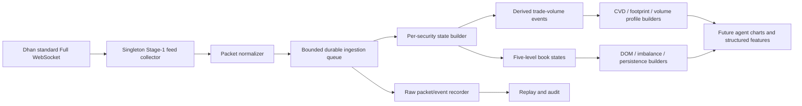

# Stage-1 Dhan Full-Feed Recording Design

Date: 2026-07-29  
Status: Documentation and decision support only  
Implementation status: Not approved and not implemented

Official references verified on 2026-07-29:

- [DhanHQ v2 Live Market Feed](https://dhanhq.co/docs/v2/live-market-feed/)
- [DhanHQ v2 Historical Data](https://dhanhq.co/docs/v2/historical-data/)
- [DhanHQ v2 Full Market Depth](https://dhanhq.co/docs/v2/full-market-depth/)
- [DhanHQ v2 Market Quote](https://dhanhq.co/docs/v2/market-quote/)

## 1. Purpose in simple words

Dhan historical data gives candles: open, high, low, close, volume, timestamp, and open interest where applicable. It does not provide a historical replay of every order-book update, and it does not identify whether each traded quantity was initiated by a buyer or seller.

That means the system cannot correctly create historical:

- Cumulative Volume Delta
- Footprint charts
- DOM history or heatmaps
- Persistent bid/ask imbalance
- Order-book replenishment/cancellation behavior

after the market has closed.

If these features are desired later, the system has to subscribe to the live feed before market open and record the data itself while the market is running.

This design describes how to record the standard Dhan **Full** feed for all Stage-1 instruments. It is not the Dhan 20-level or 200-level market-depth service.

## 2. What Dhan feeds provide

### 2.1 Historical candle API

The historical/intraday API provides:

- Open
- High
- Low
- Close
- Volume
- Timestamp
- Open interest where applicable
- Supported candle intervals

It does not provide:

- Historical order-book levels
- Historical bid/ask changes
- Historical order counts at each level
- Explicit aggressor side for each trade
- Market participant identity

This is suitable for price charts, indicators, RVOL, price structure, and TPO. It is not enough for true order-flow charts.

### 2.2 Live ticker, quote, and Full modes

The Dhan live market-feed WebSocket supports progressively richer packet modes.

For the proposed recorder, the useful standard Full packet can provide fields such as:

- Last traded price
- Last traded quantity
- Last traded time
- Average traded price
- Cumulative session volume
- Total buy quantity
- Total sell quantity
- Session open, high, low, and close
- Open interest fields for applicable derivatives
- Five market-depth levels

Each of the five levels can include:

- Bid price
- Bid quantity
- Number of bid orders
- Ask price
- Ask quantity
- Number of ask orders

These are live snapshots/updates. They are valuable only if the project records them at the time they arrive.

### 2.3 Connection and subscription shape

The current Dhan documentation describes:

- Up to five live-market-feed WebSocket connections per user
- Up to 5,000 instruments per connection
- Up to 100 instruments in one subscription request message
- Multiple subscription messages can be sent

The current Stage-1 universe of roughly 182 instruments can therefore fit on one standard live-feed connection and be subscribed in two messages, provided the documented account and connection limits remain unchanged when implementation begins.

These limits must be verified against the official Dhan documentation and the account entitlement on the implementation date.

### 2.4 What this design does not use

Dhan also has deeper market-depth products.

The currently documented shapes include:

- 20-level depth for a limited number of NSE instruments per connection
- 200-level depth for one NSE instrument per connection

Those services do not solve the Stage-1 BSE-wide recording requirement:

- Stage 1 contains many instruments.
- The target securities use BSE equity identifiers in this project.
- The deeper feed is capacity constrained and documented for NSE segments.

Therefore, this document proposes only the standard five-level Full feed for Stage 1.

## 3. What can be known exactly versus estimated

### 3.1 Directly observed fields

If successfully recorded, these are direct feed observations:

- Timestamp of receipt
- Exchange/security identifiers
- LTP
- Last traded quantity and time
- Cumulative session volume
- Average price
- Total buy/sell quantities
- Five visible bid and ask levels
- Visible quantity and order count at those levels
- Session OHLC

“Direct” still does not mean perfect. Packets can be missed during disconnects, and the feed exposes only visible depth.

### 3.2 Derived but exact under normal feed continuity

The positive difference between successive cumulative-volume values gives newly reported volume:

```text
new_volume = max(0, current_cumulative_volume - previous_cumulative_volume)
```

This is exact only when:

- Both packets belong to the same session.
- No reset or correction occurred.
- The relevant updates were received.

The recorder must detect resets and gaps instead of treating a negative difference as a trade.

### 3.3 Estimated aggressor side

The standard feed does not explicitly say “buyer initiated” or “seller initiated” for every trade. Side must be inferred.

A conservative classifier can use:

1. **Quote test**
   - Trade at or above the prevailing ask: buyer-initiated estimate
   - Trade at or below the prevailing bid: seller-initiated estimate
2. **Midpoint test**
   - Trade above midpoint: buyer estimate
   - Trade below midpoint: seller estimate
3. **Tick test fallback**
   - Price above previous trade: buyer estimate
   - Price below previous trade: seller estimate
4. **Neutral**
   - If ambiguous or the quote is stale, do not force a side

Every derived record should retain:

- Classification method
- Confidence/quality
- Quote age
- Neutral flag

The system should never present inferred aggressor side as exchange-provided truth.

## 4. Future features enabled by the recording

### 4.1 Conditional CVD

For each positive cumulative-volume increment:

```text
signed_volume =
  +new_volume for estimated buyer initiation
  -new_volume for estimated seller initiation
   0          for neutral/unknown

CVD = cumulative sum of signed_volume
```

Required chart quality fields:

- Session coverage start/end
- Disconnect duration
- Neutral-volume percentage
- Classified-volume percentage
- Volume conservation error
- Classification method mix

The name should be `INFERRED CVD` unless Dhan later supplies explicit aggressor side.

### 4.2 Conditional footprint chart

Bucket the inferred trade volume by:

- Time candle, such as one or five minutes
- Price or tick row
- Estimated buyer/seller/neutral side

Each footprint cell can show:

- Estimated buy volume
- Estimated sell volume
- Delta
- Total classified volume
- Neutral volume
- Imbalance flag when the comparison rule is satisfied

Accuracy depends on receiving sufficiently granular volume/price changes. If one packet aggregates volume across trades or prices, that volume cannot be precisely distributed. Such records must go to an unknown/aggregate bucket.

### 4.3 Five-level DOM history

Store every observed five-level book state or change. This can later show:

- Visible liquidity appearing/disappearing
- Top-five-level imbalance
- Spread changes
- Queue concentration
- Repeated replenishment near a price
- Book movement before and after a price move

This is a recorded five-level DOM history. It is not a complete exchange order book and should not be presented as 20/200-level depth.

### 4.4 Order-book imbalance

Example top-five imbalance:

```text
sum(bid quantities) - sum(ask quantities)
------------------------------------------------
sum(bid quantities) + sum(ask quantities)
```

Useful variations:

- Level-weighted imbalance, giving more weight to prices near the touch
- Order-count imbalance
- Persistence over several seconds
- Change in imbalance rather than only the absolute value

A single snapshot is noisy. Persistence and data-quality requirements are essential.

### 4.5 Replenishment and cancellation heuristics

The recorder can observe that:

- Visible quantity repeatedly returns after trades occur near a price.
- Quantity disappears without matching inferred trade volume.

These support hypotheses about replenishment or cancellation. They do not prove participant intent, spoofing, iceberg orders, bank activity, or operator identity.

The agent can reason about those possibilities, but the underlying feature should remain labeled as an observation or heuristic.

### 4.6 Exact versus estimated volume profile

If packet granularity is sufficient to associate positive volume changes with trade prices, a recorded volume-at-price profile can be substantially better than distributing candle volume over candle range.

However:

- Aggregated packets may still make some volume price-ambiguous.
- Neutral/aggressor ambiguity affects delta, not total volume.
- Coverage gaps reduce profile completeness.

The system should store unallocated volume and publish a profile completeness percentage.

## 5. Proposed architecture



### 5.1 One market-feed owner

Use one singleton process/service to own the Stage-1 connection.

Do not let every stock agent create its own Dhan WebSocket. That would:

- Waste connection capacity
- Duplicate packets
- Create inconsistent histories
- Make reconnect and data-quality tracking much harder

Agents consume stored or published normalized evidence; they do not own the recorder.

### 5.2 Subscription lifecycle

Proposed trading-day sequence:

1. Resolve the final Stage-1 universe before market open.
2. Resolve and validate security IDs and exchange segments.
3. Connect before 09:15 IST.
4. Subscribe in batches of no more than the current documented message limit.
5. Confirm ticker acknowledgements.
6. Start session-quality tracking before the opening prints.
7. Record continuously through the desired post-close buffer.
8. Finalize files/manifests and session-quality summaries.

The collector should not assume it can backfill a missed opening period later.

### 5.3 Raw-first storage

Store the raw normalized events before deriving CVD or DOM features.

Raw-first storage allows:

- Replaying a day after classifier changes
- Auditing a suspicious chart
- Rebuilding footprints with a different price bucket
- Measuring packet gaps
- Comparing derived versions

Suggested logical datasets:

#### `full_feed_events`

- Trading date
- Receive timestamp
- Exchange timestamp/last trade time when present
- Exchange segment
- Security ID
- Packet type
- LTP/LTQ/LTT
- ATP
- Cumulative volume
- Total buy/sell quantity
- OHLC
- OI fields when present
- Five bid levels
- Five ask levels
- Connection/session ID
- Packet-quality flags

#### `derived_volume_events`

- Security ID
- Timestamp
- Positive volume delta
- Associated price
- Estimated side
- Classification method
- Quote age
- Confidence
- Neutral reason
- Source event IDs

#### `book_state_events`

- Security ID
- Timestamp
- Best bid/ask and spread
- All five depth levels
- Per-level changes
- Aggregate imbalance
- Data-quality flags

#### `session_quality`

- Expected and actual start
- End time
- Connected duration
- Disconnect intervals
- Packet count
- Invalid packet count
- Cumulative-volume resets
- Classified/neutral/unallocated volume
- Volume conservation error
- Maximum quote age
- Reconnect count

### 5.4 Physical storage

For an initial pilot, partitioned Parquet is a practical raw store:

```text
market_data/
  trading_date=2026-07-29/
    exchange_segment=BSE_EQ/
      security_id=12345/
        full_feed_events-000.parquet
```

Use:

- A versioned schema
- Compression
- Atomic file finalization
- A manifest for each day
- Checksums or row counts
- Explicit timezone fields

A database such as ClickHouse can be evaluated after measuring real packet volume and query needs. Do not estimate permanent infrastructure from unmeasured packet rates.

## 6. Capacity and storage planning

### 6.1 Instrument capacity

For approximately 182 Stage-1 instruments:

- One standard connection can carry the universe under the currently documented 5,000-instrument connection limit.
- Subscription messages need batching because the current message limit is lower.
- Keep a second connection available for controlled failover only if Dhan permits the desired simultaneous behavior and duplicate handling is implemented.

Do not reserve 20-level or 200-level connections for all Stage-1 instruments; the documented capacity and segment limitations do not fit this use case.

### 6.2 Measure before sizing

Storage depends on live packet frequency, security activity, serialization, and compression.

Pilot measurements:

```text
raw bytes per day
compressed bytes per day
packets per instrument per minute
peak packets per second
queue backlog at peak
CPU time per packet
write amplification
```

Then estimate:

```text
daily storage =
  measured compressed bytes per instrument-session
  × instrument count
  × retention copies

required ingest throughput =
  measured peak packets per second
  × safety factor
```

Use a safety factor based on measured opening and closing bursts, not the quiet midday average.

### 6.3 Backpressure

The ingestion queue must be bounded and observable.

Priority under overload:

1. Preserve raw packet/event records.
2. Preserve session-quality/gap records.
3. Defer derived calculations.
4. Never silently discard without incrementing a dropped-event counter.

Derived charts can be rebuilt later; silently lost raw events cannot.

## 7. Correctness and data-quality rules

### 7.1 Session boundaries

- Use the India market timezone explicitly.
- Start a new cumulative-volume state each trading session.
- Detect holidays and exceptional sessions through the market calendar.
- Do not join yesterday’s cumulative volume to today’s.

### 7.2 Reconnect handling

On disconnect:

1. Record the disconnect start.
2. Reconnect with bounded exponential backoff.
3. Resubscribe the exact instrument set.
4. Record the first post-reconnect packet.
5. Mark the missing interval.
6. Rebuild the current book state from the new Full packet.
7. Do not invent packets for the gap.

CVD and footprint coverage after a gap must visibly report reduced quality.

### 7.3 Duplicate handling

WebSocket reconnect or internal retries can repeat states.

Use a conservative identity based on available fields, such as:

- Connection/session ID
- Security ID
- Receive timestamp
- Last trade time
- Cumulative volume
- LTP
- Depth-state hash

Do not remove two legitimate book updates merely because LTP and volume did not change; the depth can change independently.

### 7.4 Cumulative-volume checks

For every security:

- Ignore zero deltas for trade-volume derivation.
- Treat a negative delta as reset/correction until explained.
- Flag implausibly large jumps for review.
- Track:

  ```text
  classified buy volume
  + classified sell volume
  + neutral volume
  + unallocated volume
  ```

  against positive cumulative-volume changes.

### 7.5 Quote age

Aggressor classification must use the quote that existed before or at the trade observation, not a future quote.

If the quote is older than the approved threshold:

- Fall back conservatively, or
- Mark the volume neutral

Do not use a later book state to classify an earlier trade.

### 7.6 No-lookahead replay

Replay builders must process events in timestamp order. A historical backtest must not inspect future Full packets when deriving the current event.

### 7.7 Opening auction and unusual prints

The opening period can produce:

- Large cumulative-volume jumps
- A trade price outside the immediately visible book
- Packet aggregation
- Temporary absence of a usable pre-trade quote

Classify ambiguous opening volume as neutral/unallocated instead of forcing it into buy or sell CVD.

## 8. Quality gate before agent use

Recorded order-flow features should not be sent to the stock agent merely because files exist.

Per security/session, require a quality envelope:

```json
{
  "coverage_start": "09:14:50+05:30",
  "coverage_end": "15:30:10+05:30",
  "connected_percent": 99.94,
  "disconnect_seconds": 13.4,
  "classified_volume_percent": 82.1,
  "neutral_volume_percent": 12.8,
  "unallocated_volume_percent": 5.1,
  "volume_conservation_error_percent": 0.0,
  "maximum_quote_age_ms": 920,
  "quality": "usable_with_warning"
}
```

Suggested states:

- `good`
- `usable_with_warning`
- `unusable`

An unusable CVD/footprint/DOM artifact should be omitted, not replaced with a confident-looking chart.

Thresholds should be set only after the pilot reveals realistic feed behavior.

## 9. Pilot plan

This is a proposed future experiment, not authorization to implement.

### Phase A — Record without agent use

- Select 5-10 representative Stage-1 BSE stocks:
  - High volume
  - Medium volume
  - Low volume
  - Different price/tick ranges
- Record three to five complete market sessions.
- Store raw events and quality manifests.
- Do not send order-flow features to agents.

### Phase B — Validate

- Compare recorded cumulative volume with Dhan quote/candle totals.
- Inspect disconnects and duplicate behavior.
- Measure neutral/unallocated volume.
- Measure packet aggregation at open and close.
- Replay raw events and verify deterministic outputs.
- Compare inferred classifications with visible quote/trade behavior on sampled windows.

### Phase C — Build research-only charts

- Inferred CVD with quality envelope
- Footprint with neutral volume
- Five-level DOM history
- Persistent imbalance
- Recorded volume-at-price

Label every inferred or incomplete component.

### Phase D — Decide agent exposure

For each artifact, answer:

- Does it add information beyond price/volume charts?
- Is it stable across replay?
- Is coverage high enough?
- Does the model understand the quality label?
- Does it improve decisions in shadow evaluation?
- Does it increase false confidence?

Only approved artifacts enter the agent contract.

### Phase E — Expand to all Stage-1 instruments

- Expand after throughput/storage measurements.
- Retain the same raw schema and quality gates.
- Monitor opening burst behavior.
- Keep derivation asynchronous so recording is never blocked by chart rendering.

## 10. What this recorder will and will not enable

| Feature | Possible after recording? | Accuracy statement |
|---|---:|---|
| Session OHLCV | Yes | Direct/live plus historical cross-check |
| Five-level DOM history | Yes | Exact for received visible five levels; incomplete during gaps |
| Five-level imbalance | Yes | Derived from received visible depth |
| Inferred CVD | Conditionally | Aggressor side is estimated, not supplied |
| Inferred footprint | Conditionally | Limited by packet aggregation and side inference |
| Recorded volume profile | Conditionally | Stronger than candle estimate when volume can be associated with price |
| 20/200-level BSE DOM | No under this design | Standard Full feed has five levels |
| Historical backfill of missed DOM | No | Must be recorded live |
| Participant identity | No | Feed does not reveal bank/fund/operator identity |
| Hidden orders | No | Only visible book can be observed |
| Proof of spoofing/icebergs | No | Only heuristics/hypotheses are possible |

## 11. Operational safeguards

- Recorder credentials remain server-side.
- Never log access tokens.
- Rotate daily files atomically.
- Alert when the collector is not connected before open.
- Alert on queue drops, long gaps, schema failures, and disk pressure.
- Keep raw data retention and deletion policy explicit.
- Version every classifier and chart builder.
- Store the version used in each derived artifact.
- Use a separate research flag before any new artifact reaches the live stock agent.

## 12. Decision checklist

Before implementation approval, decide:

- Is the standard five-level Full feed sufficient for the research goal?
- How many raw trading days should be retained?
- Is Parquet enough for the pilot?
- What quality level is required before an artifact is shown to the agent?
- What neutral-volume percentage is acceptable for inferred CVD?
- How should reconnect gaps be displayed?
- Which 5-10 BSE stocks should be used in the pilot?
- Should collection start for the full Stage-1 list immediately, or only after the pilot?
- Which derived artifacts, if any, are allowed into the stock-agent prompt?

Until those decisions are made, the implementation should remain paused.
