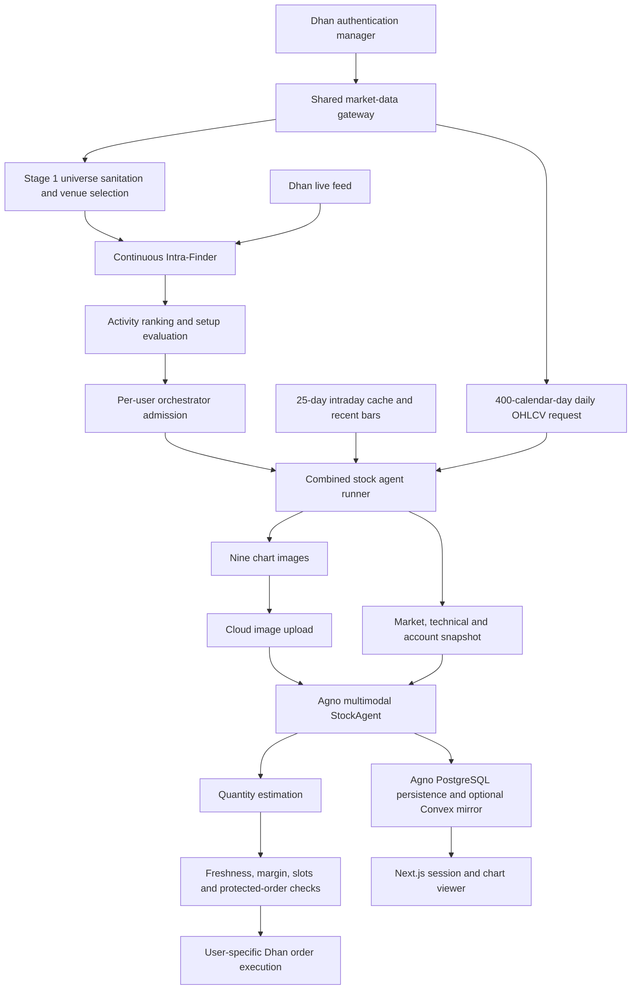

# System and agent chart audit, 6 September 2026

The missing daily timeframe was a real information gap. A stock could reach a base formed weeks earlier while the agent saw only today's candles and the previous session. The new bundle includes daily history, and new charts no longer draw the yellow vertical SIGNAL marker.

This review traces the active market-data, selection, chart-generation, model-input, execution and persistence paths. It also checks the older analyzer/risk/execution consumers and inspects saved examples of all eight original stock chart types. It is an architecture and chart-evidence review, not a claim that every line of the repository, reference projects and historical experiments has been exhaustively verified. Improved model decisions or profitability have not been measured.

The working tree already contained a change to `context.md`. This work leaves it alone.

The active system is event driven. Several older architecture documents describe retired batch flows and outdated chart counts; source code and Docker service wiring take precedence.

| Area | What the source currently does | Relevance to this change |
|---|---|---|
| Deployment | `docker-compose.yml` runs authentication, shared data gateway, universe scanner, Intra-Finder and AI-agent services. NIFTY depth recording defaults to disabled. | Generating NIFTY research charts does not make them agent inputs. |
| Universe selection | `stages/universe_scanner.py` sanitizes instruments, compares venues and builds historical baselines. Its default daily history request is only 60 calendar days. | That cache cannot supply a year of daily context. The new chart makes a separate request with the candidate's exchange segment. |
| Live selection | `stages/intra_finder.py`, `activity_ranker.py`, `live_state.py` and setup detectors maintain live state, rank activity and emit qualified events. | Selection is upstream of the image-based decision. Changing image overlays must not change event generation. |
| Admission | `runtime/run_ai_trading_orchestrator.py` manages user configuration, event admission, run state and frontend broadcasts. `run_stock_agent.py` validates event date, expiry and exchange. | Chart generation remains inside an admitted candidate evaluation. |
| Market data | `services/dhan_service.py` owns daily/intraday conversion, rate limiting, retries and gateway access. `signal_data_cache.py` supplies cached intraday history and recent bars. | Daily candles use the existing daily endpoint and timezone conversion, not aggregates of a few intraday sessions. |
| Agent input | `run_stock_agent.py` builds charts, uploads images and assembles `StockDecisionContextBuilder` output. `StockAgent` receives images and one initial snapshot. | Adding a renderer alone would not work. The required chart keys, order, metadata transport and prompts also needed changes. |
| Agent tools | The active agent receives quantity estimation and protected entry placement. Read-only evidence is supplied up front. | Missing analytical metadata cannot be recovered through a read tool in this active workflow. |
| Execution | `stock/toolkits/execution_toolkit.py` and `order_placement_gate.py` check margin, active slots, quote/candle freshness and entry drift before placing a protected order. | Better images do not replace execution checks. |
| Persistence | `cloud_persistence_service.py` stores native Agno sessions in PostgreSQL and can mirror to Convex. Images are uploaded separately. Next.js routes and session utilities display stored evidence. | Ordered image transport already supports an additional image. Historical saved images retain their original content. |
| Older workflow | Separate stock analyzer, risk analyzer and executioner classes remain. | Analyzer receives daily history; risk selection includes it when present; execution fallback and prompts now acknowledge it. Old bundles remain readable. |

The daily endpoint returns real daily OHLCV and identifies the instrument by security ID and exchange segment. Its documented end date is exclusive. The implementation also filters out the decision date and later dates independently. [Dhan historical-data documentation](https://dhanhq.co/docs/v2/historical-data/).

The new `stock-evidence-v6` bundle has this order:

| Position | Image | Information it contributes | Assessment |
|---|---|---|---|
| 1 | Current 1m | Last 90 available bars, execution location and immediate candle geometry | Useful for entry timing. It cannot show a full session after the first 90 bars. Sparse trading can make 90 bars span more than 90 minutes. |
| 2 | Current 5m | Current-session setup, VWAP and trend overlays | Useful core chart. Some information repeats in the structure image. |
| 3 | Current 15m | Slower intraday structure | Useful once enough session bars exist. Early in the session the price geometry remains limited even with warmed indicators. |
| 4 | Previous-session 15m | Previous auction, closing location and gap context | Useful context but only one previous session. It cannot show the origin of older levels. |
| 5 | Daily 1D | Up to 250 completed daily candles, daily volume and a separate current-price reference | Highest-priority addition for the stated problem. Shows multiweek bases, advances, selloffs and retests. It deliberately does not label inferred institutional zones. |
| 6 | Volume/participation | Five-minute volume, same-time historical median, cumulative volume band and RVOL | Useful participation evidence. Missing intraday minutes still need stronger coverage handling. |
| 7 | Momentum/volatility | RSI and ATR percentage for 1m, 5m and 15m | Useful as supporting evidence. Candidate for removal from the default image bundle after numerical-only comparison testing. |
| 8 | Price-structure liquidity | Opening range, prior levels, equal highs/lows and deterministic sweep annotations | Useful geometry, but the word liquidity must not be interpreted as observed orders. Annotations remain heuristic. |
| 9 | Current/previous TPO | Distribution of price-range coverage across time brackets | Useful auction context when coverage is adequate. It is an OHLCV approximation, not exact traded volume at price. |

Saved Jupiter Wagons images from 28 August were inspected for every original chart type. A new Firstsource Solutions BSE preview was rendered from saved intraday history, cut at 24 August 11:37 IST, and separately saved daily history filtered to earlier sessions. That daily cache supplies 36 usable sessions. The preview labels that count honestly. The production request asks for 400 calendar days and displays the latest 250 available completed sessions. A separate image labelled SYNTHETIC READABILITY TEST exercises the 250-candle layout; it is not market evidence.

The preview demonstrates the information gap without establishing a trade outcome: its daily image shows a late-July rise and early-August decline that are invisible in the two-session intraday bundle.

Changes implemented:

- Added validated daily OHLCV input and a dedicated daily candlestick/volume renderer. Invalid prices, inverted OHLC ranges and negative volume fail validation. Dates are normalized to the market timezone, duplicate session dates collapse, and current/future dates are excluded.
- Added a 400-day request through the existing Dhan service. In the combined runner it runs alongside initial quote/account work. Failed or empty daily history stops that candidate before model invocation rather than silently claiming complete context.
- Replaced the active hard-coded eight-image count check with required chart keys, including `daily_1d`. The established requirement for a previous-session chart remains.
- Updated prompts, attachment titles and older consumers for daily context. The prompts distinguish completed daily bars from the current intraday reference and explain that older unseen zones can still exist.
- Removed the yellow SIGNAL line and text from price and volume images. Signal time remains audit metadata. Stage-2 human replay event markers and archived images were not rewritten.
- Passed analytical metadata and an ordered chart manifest through `StockTechnicalToolkit` and `StockDecisionContextBuilder`. The older analyzer also receives analytical metadata.
- Aligned current price-chart EMA, RSI, ATR and Bollinger readings with prior-session warmup. VWAP still resets by session. The current 5m numeric RSI/ATR now agree with the momentum panel to the displayed precision. Missing warmed ATR displays N/A rather than a fabricated zero.
- Fixed warmed RSI for a price series with no losses and for a flat series.
- Replaced wall-clock completion checks in current price, participation and sweep calculations with the input data cutoff. A replay ending at 11:37 does not claim that the 11:35-11:40 bar is complete just because it is rendered later. The last input minute's timestamp is a conservative cutoff; no unobserved minute is assumed complete.
- Excluded future sessions and out-of-session rows from the bundle input; duplicate intraday timestamps are collapsed.
- Serialized stock bundle rendering within the process. Candidate runners use threads, while pyplot tracks a process-wide current figure; this prevents one stock's chart operations from targeting another stock's figure. Broker/context fetching can still overlap. Rendering throughput should be measured before raising candidate concurrency.
- Aligned TPO brackets with 09:15 and gave the two panels a common price range. TPO systems expose session/subperiod alignment as an explicit construction choice; this chart now uses the session-open convention. [Sierra Chart TPO documentation](https://www.sierrachart.com/index.php?l=doc/StudiesReference/TimePriceOpportunityCharts.html).

Remaining issues and the cheapest useful checks:

| Priority | Confirmed source behavior or limitation | Why it matters | Next check or change |
|---|---|---|---|
| High | `_detect_supply_demand_zones` uses impulse/base geometry and the final close, without a complete breach/retest lifecycle. | A zone can look authoritative after being invalidated earlier. It also only sees the session frame for intraday overlays. | Store origin time, confirmation time, breach policy, retest count and invalidation. Test a breach followed by recovery. Until then, treat shading as a hypothesis. |
| High | Historical daily prices have no verified corporate-action adjustment contract in the chart path. | A split, bonus or another price discontinuity can resemble a base or gap. | Compare overlapping daily and intraday OHLC, inspect corporate-action events, and mark affected ranges. The new daily image and prompt state the uncertainty. |
| High | Volume baselines qualify prior days by early/late endpoint presence, then fill missing interior minutes with zero volume. | A feed outage can depress the baseline and inflate apparent RVOL. | Use expected/observed minute coverage, exclude incomplete reference days, and distinguish missing data from confirmed zero trading. Test a midday outage. |
| Medium | There is no measured before/after model evaluation for these image changes. | Additional context can help location assessment but can also add processing cost or conflicting evidence. | Run a frozen replay comparison with identical model, prompts, cutoff, numerical snapshot and sampling settings. Disable execution tools. |
| Medium | Daily history adds one broker request per candidate; there is no dedicated completed-daily cache in this new path. | It increases latency and shares the historical API budget. | Measure chart-ready latency. If material, prewarm a cache keyed by exchange, security ID, requested span and market date, with atomic writes and freshness validation. Do not substitute the existing 60-day cache. |
| Medium | The daily display is capped at 250 sessions. | It still cannot show every old price level. Provider history may also be shorter or stale. | Use the explicit first/last dates. Consider conditional weekly context for longer history and validate last-session freshness against the exchange calendar. |
| Medium | TPO fills each 30-minute bracket's low-high range and independently chooses a row size for each session. | This is a range-coverage approximation; gaps within a bracket are not proven trades. Profile detail can differ between panels. | Consider a shared row size, minute-range union construction and explicit initial-balance completeness. Validate gap and early-session cases. |
| Medium | TPO level labels can overlap when POC, value-area and initial-balance levels coincide. | Exact numbers become hard to read visually. | Use collision-aware labels or a compact numerical rail. Exact metadata is now available to the agent. |
| Medium | Structure sweeps use rules, not observed stop orders; their ATR calculation remains session based. | A wick through a level does not prove institutional intent, and its heuristic tolerance has a different basis from warmed ATR. | Name the calculation basis explicitly and evaluate event definitions independently before changing thresholds. |
| Medium | Intraday patterns and zone metadata can include a developing final bar. | An unfinished shape can disappear. | Keep the provisional flag visible; separately expose confirmed-pattern and developing-pattern lists. |
| Low | `_render_chart_legacy` remains in the service and contains retired multi-panel rendering. | Old code is easy to mistake for the active chart path. | Remove it after confirming external scripts do not call it; it is not used by the audited bundle builder. |

My recommended next images, in order, are engineering proposals rather than proven improvements:

| Addition | What it would answer | Implementation condition |
|---|---|---|
| Multi-session 60m candles over roughly 15-20 sessions | Where did the base or retest form between the daily scale and today's 15m view? | Highest-priority next experiment. Reuse available intraday history, anchor aggregation at 09:15, separate sessions and label the shorter final interval. Prefer testing it as a replacement for previous-day 15m before expanding the bundle again. |
| Conditional weekly context over several years | Is price approaching a level older than the daily display? | Requires a longer daily request and completed-week aggregation. Show only when that extra history answers a specific location question. |
| Stock versus relevant sector/index relative strength | Is the move stock specific or part of a broad move? | Align instruments and timestamps, normalize the series and keep current stock evidence primary. The active workflow currently suppresses regime context, so this is a separate product decision. |
| Spread, depth capacity and slippage timeline for the selected stock | Is an attractive setup actually executable at the intended size? | Use recorded live data with coverage timestamps. Numerical execution checks remain authoritative. |
| Trade-derived footprint/CVD or volume profile | Is there actual traded-volume evidence at the level? | Only with a verified stock-specific trade stream, deduplication and a disclosed trade-side classification method. Never manufacture it from candle color or substitute NIFTY futures flow for stock flow. |

I would not add another collection of oscillators, repeat the same price pane across more images, or automatically attach the NIFTY depth research pack. The largest remaining gains are longer price context, honest data coverage and reliable annotation semantics.

To measure whether a chart helps the AI, use the existing saved replay infrastructure with order placement disabled. Compare the old bundle, old plus daily, and daily plus a multi-session chart. Then remove the momentum/TPO images one at a time while retaining their numerical evidence. Score older-level recognition, entry-location errors, unsupported order-flow claims, provisional-candle mistakes, abstention quality, latency and image cost. Evaluate trade outcomes after costs separately. This audit did not run paid model calls or claim a win-rate improvement.

Validation completed:

- 87 focused chart, toolkit, snapshot, analyzer-prompt, history-cache, architecture, admission and Dhan-resilience tests passed after the changes.
- New tests render all nine images, prohibit vertical signal lines, verify the 250-session cutoff, validate short/invalid history, check TPO alignment and monotonic RSI, verify daily request exchange/span, and trace daily evidence into the final agent snapshot.
- A broader test run before the final two test additions reported 190 passed, 3 failed and 5 subtests passed. The failures are outside edited behavior: two reference the absent `components/trading-status.tsx`, and one unisolated gateway toggle test reaches Convex while its Python client is unavailable. The latter was not rerun against live cloud state.
- Python compilation and whitespace checks passed during verification. Generated daily, TPO and price previews were visually inspected.
- No trading service was restarted, no order was placed, and no archived decision image was overwritten. Live daily-provider success, image upload and provider-side vision resizing were not exercised by the offline preview.

Preview files are in `artifacts/chart-audit-2026-09-06`. The saved `chart-bundle.json` records all nine image paths and their metadata.
