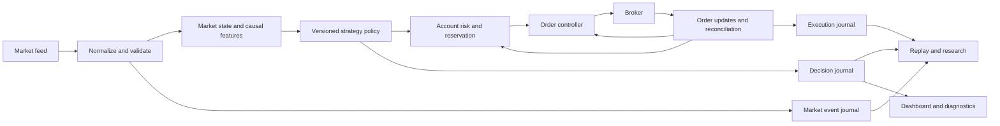

# Replacing trading agents with a systematic intraday engine

Research and architecture assessment for Trader. September 30, 2026, IST.

This report combines a broad internet search with targeted inspection of the repository. External claims use primary sources: exchanges, regulators, broker documentation, research papers, company disclosures, and maintainers' documentation. Proposed strategies, thresholds, architecture, and sequencing are my recommendations, not established profitable results. No trading code, live settings, or orders were changed.

## 1. Decision

I recommend replacing conversational AI agents in the live decision and execution path with a deterministic, event-driven trading engine. Start with selective, cost-aware intraday strategies that hold positions for minutes. Investigate shorter scalps only after measuring data quality, fill quality, and how quickly the signal decays.

I do not recommend starting with exchange-level HFT through the current Dhan retail API setup. HFT is a business that depends on market access, information timing, queue position, and execution economics. Running a strategy more often does not supply those advantages.

Your proposed direction solves a real engineering problem. It does not yet solve the research problem of finding positive net expectancy. A deterministic engine can enter losing trades faster and more consistently too.

The recommendation has four parts:

1. Remove LLM judgment and tool selection from entry, sizing, risk, order submission, and position management.
2. Keep and audit useful deterministic infrastructure already in the repo.
3. Build a replay and execution simulator before increasing trading frequency.
4. Permit learned numerical models later, if they outperform simple baselines after realistic costs. A frozen neural network can sit inside a controlled trading engine without a conversational agent.

My confidence is high that this produces a more reproducible and measurable system. Confidence that any particular strategy will be profitable is currently low because this task did not establish its net out-of-sample performance.

## 2. What we mean by HFT, scalping, and determinism

These concepts describe different things.

| Concept | Meaning | Implication for this project |
|---|---|---|
| Deterministic decision system | Recorded inputs, prior state, clock events, configuration, and model version reproduce the same decisions | Achievable now and valuable at every horizon |
| Systematic intraday trading | Explicit rules or statistical models open and close exposure within the session | Best initial target |
| Scalping | Small expected price changes and short holding periods | Costs and fill assumptions become especially demanding |
| HFT | Strategies whose competitiveness depends strongly on very fast information processing and execution, often with substantial message activity | Requires an access and economics assessment before an implementation project |
| Machine learning | Parameters learned from data rather than all specified by hand | Compatible with systematic execution |
| Conversational agent | A model chooses analytical steps and tools from prompts and context | Poor fit for a bounded, time-sensitive order path |

There is no universal duration that turns a strategy into HFT. A five-second holding period on a retail API can still be slow relative to competing participants. Equally, fast infrastructure can execute strategies with longer holdings.

Define determinism at the decision boundary. The market and broker remain uncertain. Network scheduling can change arrivals. Model kernels and hardware can affect numerical reproducibility. Record the event order, pin the runtime, control randomness, use explicit rounding, and version everything needed to replay a decision. Treat live fills as external observations rather than outputs you can reproduce merely by rerunning the strategy.

NSE distinguishes best quotes, five-level depth, twenty-level depth, and tick-by-tick full order-book data. Its direct feeds use multicast and dedicated connectivity, with authorized vendors as an alternative. A broker WebSocket is a different delivery route. An aggregated book with many levels does not, by itself, provide every order event or exact queue position. [NSE real-time data products](https://www.nseindia.com/static/market-data/real-time-data-subscription).

## 3. What professional firms actually do

### Different businesses need different systems

Do not use "hedge funds" as shorthand for every automated trading firm. A systematic investment manager forecasting portfolio returns and a market maker quoting both sides of an instrument face different objectives and constraints.

| Public example | What the source establishes | Lesson we can reasonably take |
|---|---|---|
| Jane Street | Its public materials describe quantitative trading, liquidity provision, and neural-network research | Learned models and automated trading can coexist |
| Two Sigma investment management | It describes systematic research using data science and engineering | Research and portfolio construction are separate from the question of fastest execution |
| Two Sigma Securities | It describes market making and intraday alpha with low-latency execution | Even within one group, trading businesses differ |
| Citadel Securities | Its research roles describe constructing and testing models for market making | Models need hypotheses, testing, and a path into execution |
| Virtu | Its annual filing describes market data, routing, transaction processing, risk, and surveillance technology | Execution and operations are substantial parts of the system |
| Optiver | It describes FPGA trading hardware and a reproducible research platform | Live latency and offline research throughput are separate engineering problems |

Sources: [Jane Street machine learning](https://www.janestreet.com/join-jane-street/machine-learning/), [Two Sigma investment management](https://www.twosigma.com/businesses/investment-management/), [Two Sigma Securities](https://www.twosigma.com/businesses/securities/), [Citadel Securities quantitative research](https://www.citadelsecurities.com/careers/quantitative-research/), [Virtu 2025 Form 10-K](https://www.sec.gov/Archives/edgar/data/1592386/000159238626000009/virt-20251231.htm), [Optiver FPGA engineering](https://www.optiver.com/insights/technology-blog/fpga-hardware-at-optiver-making-impact-at-speed-and-scale/), and [Optiver research platform](https://optiver.com/working-at-optiver/career-hub/research-at-scale/).

These disclosures establish activities and capabilities. They do not reveal the firms' current production features, model weights, private data, fill models, or strategy returns. We cannot claim that a public paper is the exact model a named firm uses.

### The mechanisms worth understanding

Market making involves estimating fair value, posting quotes, controlling inventory, and hedging. Gross spread capture must exceed adverse selection, hedge costs, fees, and inventory losses. Being filled is not automatically good news. A passive quote can fill because an informed or faster participant knows it is now mispriced.

Relative-value trading compares economically related instruments. Examples include an ETF and its constituents, a future and its underlying, or related contracts. Apparent discrepancies must survive hedge execution, financing, contract conventions, and temporary basis changes. A retail account cannot assume it has institutional creation/redemption access or frictionless multi-leg execution.

Directional intraday trading forecasts movement over a specified horizon. It might use momentum, short-term reversal, market and sector returns, order-book information, or event data. Its signal can remain useful for minutes, making it a more plausible starting point with broker APIs.

Execution algorithms determine how to acquire or dispose of an already chosen position. Scheduling, participation control, and passive/aggressive placement can reduce execution losses. They do not necessarily generate directional alpha.

These are economic distinctions and design implications, not claims about undisclosed firm strategies. Our immediate task is to identify which mechanism we can observe and execute at a net advantage.

## 4. What the published research supports

### Order-flow imbalance is a useful research direction

Cont, Kukanov, and Stoikov studied order-book events in 50 US stocks and found a relationship between short-interval price changes and imbalance at the best quotes, with impact depending on depth. This supports testing supply/demand changes as features. It does not establish that our feed reveals the same events or that their relationship yields a profitable Indian retail strategy. [The price impact of order book events](https://arxiv.org/abs/1011.6402).

Gould and Bonart used logistic regression to study queue imbalance and the next mid-price move in ten Nasdaq stocks. Their reported predictive improvement differed between large-tick and small-tick stocks. This makes a simple statistical model a sensible baseline before a deep network. [Queue imbalance as a one-tick-ahead price predictor](https://arxiv.org/abs/1512.03492).

For our research, distinguish static displayed imbalance from changes in the book. A disappearing quantity can represent a trade, cancellation, modification, or a change outside the visible depth. With aggregated snapshots, some causes are unobservable. Call the feature "snapshot imbalance change" when that is what we actually measure.

### Market-making models explain inventory control

Avellaneda and Stoikov formulate market making around inventory and information risk. The useful lesson is that the quote center and quote width should account for inventory and uncertainty. Their mathematical model is a starting point for research, not a turnkey profit generator with a broker feed and retail fees. [High-frequency trading in a limit order book](https://math.nyu.edu/inmemoriam/avellaneda/HighFrequencyTrading.pdf).

### Deep learning can learn book patterns

DeepLOB combines convolutional processing of book structure with LSTM temporal modeling. The authors report price-direction results on benchmark data and London market quotes. That is evidence for a modeling approach. Classification accuracy does not establish executable net P&L, particularly across markets, feeds, tick sizes, and cost schedules. [DeepLOB](https://arxiv.org/abs/1808.03668).

Our eventual neural model must predict something tradable. Predicting a tiny midpoint change before we can act is insufficient. Useful targets include return after realistic entry latency, fill probability, post-fill adverse movement, or a cost-adjusted entry outcome.

### Reinforcement learning has an extra simulation burden

ABIDES is a discrete-event market simulation environment designed for market-agent research. It is useful for controlled experiments with interacting participants. A policy can also exploit unrealistic simulator behavior, so success in a synthetic market needs separate validation against real execution. [ABIDES](https://arxiv.org/abs/1904.12066).

I would defer reinforcement learning. We do not yet have the measured fill and latency models needed to trust its environment. This is a sequencing decision, not a claim that RL never works.

### Research itself can manufacture false winners

Bailey and coauthors study the probability of backtest overfitting. Bailey and Lopez de Prado's deflated Sharpe ratio addresses selection bias and non-normal returns. Their work supports tracking all experiments and correcting for selection rather than reporting the winner as if it were our only hypothesis. [Probability of backtest overfitting](https://www.davidhbailey.com/dhbpapers/backtest-prob.pdf), [Deflated Sharpe ratio](https://www.davidhbailey.com/dhbpapers/deflated-sharpe.pdf).

## 5. Assessment of the current Trader repository

This was targeted architecture inspection, not a complete production audit. Local defaults are not proof of the environment overrides used by a running deployment.

### Much of the foundation already exists

| Inspected component | Existing behavior or role | Recommendation |
|---|---|---|
| `pipeline/stages/universe_scanner.py` and sanitation modules | Universe and baseline preparation | Keep; verify point-in-time selection and reference-data quality |
| `pipeline/stages/intra_finder.py` | Feed processing, ranking, observations, and HTTP dispatch to trading agents | Keep useful feed logic; replace dispatch with a numerical strategy interface |
| `pipeline/stages/trade_readiness.py` | Explicit deterministic readiness evaluation | Treat as a baseline hypothesis, not an already validated alpha model |
| `pipeline/stages/indicator_event_engine.py` | Indicator event infrastructure | Reuse where causal and tested |
| `pipeline/services/feed_receiver.py` | Bounded queue and receipt timestamps, including a monotonic clock | Reuse concepts; measure backlog and overload behavior |
| `pipeline/services/latency_metrics.py` | Fixed-size delay histograms | Extend to decision, submission, acknowledgment, fills, and cancels |
| `pipeline/stock/toolkits/execution_toolkit.py` | Sizing, capacity, freshness, protected orders, and reconciliation helpers | Extract ordinary domain services from the agent toolkit boundary |
| `pipeline/stock/stock_agent.py` | Constructs an Agno agent and runs it | Replace its live judgment with a strategy policy |
| `pipeline/execution/executioner_agent.py` | Constructs and runs an execution agent | Replace its live tool selection with an order controller |
| `pipeline/research/stage2_quality_replay.py` | Historical setup evaluation and exit profiles | Reuse as research infrastructure; strengthen execution and cost modeling |

Source paths above are relative to `C:/Users/prajw/Downloads/Trader/python-backend/`.

The September 5 local review reports median event-to-first-order-attempt times of 73.8 seconds on August 31 and 91.3 seconds on September 1, compared with historical scanner expiries of 30 or 45 seconds. It also reports omitted setup context and late capacity rejections. These are historical findings from that report, not fresh measurements or a re-audit of its underlying archives. [Earlier project research](C:/Users/prajw/Downloads/Trader/research/trader-research-2026-09-05.md).

The current config differs. It defaults to indicator events, sixty-second readiness reevaluation, a 300-second readiness confirmation minimum, and a ninety-second maximum last-trade age for readiness. Different gates govern different stages. Their existence shows that simply removing the LLM does not turn the scanner into a scalper. Fast and slow policies need separate validity rules. [Current configuration](C:/Users/prajw/Downloads/Trader/python-backend/pipeline/config.py:124).

### Data capture is the immediate research constraint

`_record_observation` keeps the first received observation for an instrument in each second. It does not retain every intra-second transition in the derived tape. Raw decoded packets are optional and can be restricted to the hot set. Defaults retain raw data for seven days and derived data for ninety days. Runtime overrides may change this. [Recorder](C:/Users/prajw/Downloads/Trader/python-backend/pipeline/stages/intra_finder.py:815), [retention defaults](C:/Users/prajw/Downloads/Trader/python-backend/pipeline/config.py:127).

Consequences for research:

- A target and stop can both be crossed between saved observations without the file revealing the order.
- A displayed depth can disappear before simulated submission.
- Selective capture can bias analysis toward stocks the old selector already preferred.
- Receipt timestamps do not automatically tell us when a book update originated at the exchange.
- Old derived files cannot recreate missing packet sequences or exact passive queue position.

The quality replay defaults to a fixed 0.04% round-trip cost plus a slippage calculation. That may be useful for a scenario comparison, but it is not an exact account-, venue-, and order-size-specific fee model. At small order values, brokerage alone changes cost in basis points substantially. [Replay policy](C:/Users/prajw/Downloads/Trader/python-backend/pipeline/research/stage2_quality_replay.py:60).

There are already freshness and sizing gates. Agent removal must preserve those protections. It also needs a review of monitor loops, persisted sessions, frontend APIs, and background runtimes before any agent dependencies are deleted. An agent class's existence does not prove it is the active production path.

## 6. Data we should collect and buy only when needed

| Data | Purpose | Initial requirement |
|---|---|---|
| Point-in-time instruments and venue mapping | Avoid trading the wrong contract or leaking future universe membership | Required |
| Tick sizes, trading status, price limits, corporate actions, surveillance restrictions | Validate orders and interpret price moves | Required |
| Historical daily and minute bars | Universe research and slower intraday baselines | Required |
| Best bid/ask, quantities, volume, and last trade | Execution pricing and participation | Required |
| Every received broker packet for a predefined research universe | Replay what our live engine actually saw | Required for scalping investigation |
| Exchange event time, where supplied, plus receive and processing clocks | Separate source age, network delay, and internal backlog | Required; preserve missingness |
| Order requests, responses, updates, fills, and contract notes | Calibrate real execution and reconcile costs | Required |
| Sector and broad-market observations | Relative strength and market exposure | Useful early |
| Deeper aggregated book data | Depth-sensitive features and execution research | Add for a small cohort after checking availability |
| Order-level event feed and recovery mechanism | Book reconstruction and stronger queue analysis | Required before a credible exchange-level HFT program |
| Structured announcements and scheduled events | Event filters with known availability time | Useful; avoid untimestamped hindsight |
| Options chains, Greeks, OI, expiry history | Derivatives research and risk | Only when derivatives are in scope |
| Alternative data | Specialized slower signals | Defer until a concrete hypothesis justifies its cost |

Dhan documents up to five standard feed connections with 5,000 instruments each, and a separate twenty-level depth subscription limit of fifty instruments per connection. Its release notes also document a 200-level depth offering. Treat these as documented capacities, not measured throughput or permission to apply one feed's subscription limits to another. [Standard feed](https://dhanhq.co/docs/v2/live-market-feed/), [depth documentation](https://dhanhq.co/docs/v2/full-market-depth/), [release notes](https://dhanhq.co/docs/v2/releases/).

Verify entitlement, supported venue and segment, update behavior, instrument limits, disconnect recovery, timestamps, and recording rights for the chosen product. Do not assume the NSE depth offering supplies equivalent BSE data. More levels do not cure delivery delay or missing order identity.

Before purchasing a vendor feed, ask for sample data and a written specification. Check order-level versus price-level information, aggregation, historical coverage, symbols that delisted, timestamp meaning, sequence gaps, correction messages, and non-display/retention rights. Compare the candidate feed with our broker feed during the same market periods.

A feasible initial recording plan is a fixed cohort of roughly 20 to 50 liquid instruments with all received packets, plus broader minute-level research coverage. This is a proposed engineering scope, not a statistically optimal universe. Include instruments independently of whether a setup fired. Expand after measuring disk and CPU use. Preserve research cohorts explicitly rather than letting routine cleanup erase them.

## 7. The economics of small targets

One basis point is 0.01%. A 10-basis-point move on Rs 100,000 of position value is Rs 100 before costs.

Net trading P&L is filled-price sale proceeds minus filled-price purchase cost, less brokerage, exchange fees, statutory charges, financing where applicable, and other actual charges. Research comparisons against midpoint returns must also account for spread, slippage, impact, and adverse selection. Do not subtract spread twice if it is already included in simulated bid/ask fills.

Dhan's published cash intraday schedule lists brokerage of the lower of Rs 20 or 0.03% per executed order, sell-side STT of 0.025%, buy-side stamp duty of 0.003%, and GST on applicable fees. Its standard NSE cash transaction charge is 0.0030699%; BSE rates differ and some groups have special tariffs. [Dhan pricing](https://dhan.co/pricing/).

The following is my arithmetic using that NSE schedule. Assume one buy and one sell of approximately equal value, one executed order per side, no financing, and no spread or execution slippage. Ignore rupee rounding for this illustration. Actual contract notes govern the charged amount.

| Position value per side | Approximate fees and statutory charges | Cost versus one-side value |
|---|---:|---:|
| Rs 10,000 | Rs 10.63 | 10.63 bps |
| Rs 100,000 | Rs 82.68 | 8.27 bps |
| Rs 1,000,000 | Rs 402.01 | 4.02 bps |

These are transaction values, not required account capital. The table does not recommend leverage. Extra executed orders and different venue/group tariffs can change the result.

For Rs 100,000 per side, an illustrative combined spread/implementation penalty of another 4 bps raises the hurdle to roughly 12.27 bps. The 4-bps assumption is hypothetical and must be replaced with observed fills. A system targeting a gross 10-bps move would already face an unfavorable hurdle in that example.

Consider a separate simplified strategy with 55% winners, average gross win of 20 bps, average gross loss of 12 bps, and average total cost of 9 bps per round trip:

`Gross expectancy = 0.55 × 20 − 0.45 × 12 = 5.6 bps`

`Net expectancy = 5.6 − 9 = −3.4 bps`

A seemingly attractive win rate still loses money. More trades multiply that loss. This arithmetic is why I prefer selective minute-scale opportunities as our first target.

SEBI's July 2024 cash intraday study reported that seven out of ten individual intraday traders lost money. That finding describes its studied population, not the probability that our proposed strategy fails, and it should not be confused with equity derivatives statistics. [SEBI cash intraday study](https://www.sebi.gov.in/reports-and-statistics/research/jul-2024/study-analysis-of-intraday-trading-by-individuals-in-equity-cash-segment_84946.html).

## 8. Strategies to investigate

All entries in this table are hypotheses. No row is a validated recommendation to deploy capital.

| Strategy family | Candidate mechanism | Data and execution burden | Initial priority |
|---|---|---|---|
| Opening-range continuation | Persistent buying or selling after opening price discovery | Completed bars, quotes, relative volume, controlled entry | High |
| VWAP pullback continuation | A temporary pullback within persistent directional flow | Actual or clearly labeled estimated VWAP, causal trend and trigger rules | High |
| Relative-strength intraday momentum | Stock movement beyond market/sector movement continues | Synchronized stock, index, sector data | Medium/high |
| Conditional mean reversion | Temporary displacement reverses when flow and liquidity normalize | Event filters, spread, volatility, bounded loss rules | Medium |
| Snapshot imbalance scalp | Short-horizon supply/demand information forecasts executable movement | Complete received packets, latency tests, cost-aware labels | Experimental |
| Intraday pairs or basket residuals | Temporary relative-price displacement closes | Stable relationship tests, two-leg fills, hedge risk | Later |
| Passive market making | Earn spread while controlling inventory and toxic fills | Queue/fill models, rapid quote control, strong fee economics | Defer |
| Cross-venue latency arbitrage | Act on one venue before another adjusts | Direct access, synchronized feeds, multi-venue execution | Defer |
| Options volatility trading | Mispricing or hedge opportunities in implied volatility | Greeks, multiple contracts, hedge costs, expiry mechanics | Separate program |

For the first release, choose one family and a modest universe. Opening-range continuation or VWAP pullback can reuse current infrastructure, but reuse alone is not proof of edge.

A candidate continuation policy should define eligibility, observation window, trigger, confirmation, maximum entry drift, price validity, invalidation, position size, exit, and time expiry. Compute these as explicit values. Do not use a narrative "confidence 85" unless the number has a tested statistical meaning.

Measure relative volume against the same time of day using only past sessions. Define opening ranges from data available at the trigger time. Normalize distances by an explicitly specified volatility estimate. Combine spread and expected movement in a common unit. Require sufficient expected net opportunity, rather than applying a single fixed spread threshold to every price and horizon.

Treat market regime as uncertain and changing. A "trend day" label created using the full session leaks future information. Early labels must use information already available and can be wrong. Start with simple observable filters and test whether they improve net outcomes. Add more elaborate regime models only after that baseline.

Do not identify institutional buying solely from high volume or declare spoofing from a disappearing wall. Those are interpretations the observed data may not support. Likewise, end-of-day FII/DII aggregates should not become live stock-specific triggers before publication.

## 9. Modeling sequence

Start with three baselines: no trade, the explicit existing setup policy, and a simple statistical model. This gives us a way to tell whether new complexity adds anything.

| Stage | Model | Reason to try it | Condition for progressing |
|---|---|---|---|
| A | Fixed rules and state machines | Reproducible decisions and clear failure analysis | Net performance survives realistic replay |
| B | Linear or logistic model | Cheap inference and inspectable features | Calibration and net P&L beat A out of sample |
| C | Gradient-boosted trees | Nonlinear interactions in tabular features | Stable improvement across dates and cost scenarios |
| D | Temporal convolution/LSTM/DeepLOB-style model | Book sequence patterns | Better execution-adjusted outcomes with manageable inference and data cost |
| E | Reinforcement learning | Joint action and execution policy research | Simulator calibrated to live behavior and advantage independently validated |

The ordering is my engineering recommendation. It is not a universal ranking of algorithm quality.

A useful numerical model forecasts expected executable return, fill probability, or unfavorable post-fill movement. The order controller then makes a bounded decision using that forecast, fees, risk, and current state. It must always be able to output "no trade."

Research labels should begin after simulated decision and entry latency. For passive entries, the label must depend on whether an order would realistically fill. Incomplete or ambiguous paths should stay marked as such. Persist rejected candidates too, or we will only learn from the old engine's chosen trades.

Train on earlier sessions, validate later, and reserve a final period untouched by feature and threshold selection. Purge overlapping outcome intervals across boundaries. Fit scalers and feature selection only on training data. Keep related market days together rather than randomly mixing ticks from the same day across splits.

Deploy frozen model versions with an explicit rollback path. Disable dropout and uncontrolled sampling. Check numerical reproducibility in the intended runtime, especially near decision thresholds. Live risk limits must apply independently of the forecast. Online self-modification should wait until we have a mature experiment and rollback process.

## 10. Proposed architecture

The fast path should use small, explicit services. Keep the browser, cloud session persistence, chart generation, and research jobs outside the required order-decision loop.

### Market state

Maintain venue-specific instrument identity, quotes, visible quantities, trading status, packet receipt time, source timestamps where available, and data-quality status. Last trade time and last quote update time are different facts. A recent receipt may contain an old trade.

Handle reconnects as state invalidation and recovery. If the feed lacks sequence numbers, record local receipt order and known interruption intervals without claiming that exchange completeness has been proven. Strategies should stop using affected features until their required state is trustworthy.

Use explicit numeric conventions. Order prices should respect instrument tick size; quantities should respect lot and unit conventions. Research math can use floating point, but money accounting and order construction need specified rounding.

### Strategy contract

A decision should contain strategy and model versions, instrument and venue, side, evidence identifiers, creation and expiry times, trigger and invalidation, permitted entry range, expected movement or decision score, cost estimate, and reason codes. It should propose an action rather than possess broker credentials.

Record the state and configuration that caused the decision. For exact replay, also record timer events, reference-data updates, universe changes, and account observations that affected eligibility.

### Account risk

Reserve capacity atomically before order submission. Include open positions, pending entries, unconfirmed submissions, partial fills, manual activity, and correlated exposure. Margin availability is not the same as a safe risk budget.

Use a position size bounded by loss budget, available margin, liquidity/participation, and concentration. A basic loss-budget denominator includes the planned stop distance and an allowance for execution costs. Stops can slip or fail to execute, so separate stress limits must handle larger losses.

Risk states should distinguish allowing new entries, blocking entries, canceling entries, reducing exposure, and reconciling an unknown state. Stopping new entries must not accidentally stop management of an existing position.

### Order controller

Use explicit states such as proposed, reserved, submitting, acknowledged, partially filled, filled, cancel requested, canceled, rejected, and reconciliation required. Entry, protection, and exit orders have their own states and quantities.

A submission timeout creates uncertainty. It does not prove rejection. Persist a unique intent/correlation identifier and query broker state before resubmitting. A broker correlation field helps tracing but should not be assumed to provide server-side idempotency unless documented and verified.

Handle late fills after cancel requests, duplicated or reordered updates, missed updates, and partial fills. Protection must match actual filled exposure. Two account workers must not independently reserve the same slot or retry the same intent. Enforce a single writer or equivalent fencing for each account.

Use bounded, permitted limit-order policies and verify current market-price-protection behavior with the broker. Protective orders reduce a class of operational risk, but gaps, halts, circuits, and service failures still need an explicit recovery process.

### Journaling and overload

Raw market capture can run in batches away from the strategy loop. Order intent and risk reservation need durable recoverable state before an external submission. If we make a different durability tradeoff, document the crash behavior explicitly.

Monitor queue age as well as queue length. The current bounded receiver waits when full. That controls memory but can deliver old data after a backlog. Set a policy that blocks decisions when backlog exceeds the strategy's information budget. Do not silently discard order updates. A recorder failure or disk limit should be observable and trigger the predefined operating policy.

### Technology choices

Use Python first for research and minute-scale policies. Measure CPU and latency before rewriting. Rust or C++ may later be appropriate for a measured parser, state-update, inference, or order-path bottleneck. Switching language will not repair an old feed or broker network delay.

Keep active trading state close to the engine. Use the existing application and cloud database for configuration and visibility, with cached, versioned runtime configuration. A persistent Linux service near the broker's infrastructure is a candidate deployment, but location must be selected from latency and reliability measurements. A Mumbai cloud region is not exchange co-location.

Do not add Kafka, Kubernetes, GPU inference, or an FPGA simply because large firms use them. Each component must solve a measured requirement.

## 11. Measure speed against signal decay

Record separately:

- Source event time to local receipt, when source timestamps and clock quality allow it.
- Local receipt to decode, state update, and decision.
- Decision to risk approval and order submission.
- Submission to broker acknowledgment, and any available exchange confirmation.
- Submission to first fill and completion.
- Cancel request to confirmation, including intervening fills.

Report p50, p95, p99, and worst observed delay by time of day. An average broker response time is not a fill guarantee or an end-to-end information-age measurement.

As initial engineering targets, aim for less than 10 ms p99 internal processing for a small intraday universe, and investigate a 1 to 5 ms internal budget only for packet-driven scalp experiments. These are proposed budgets, not benchmarks achieved by this repo or broker. Choose final targets from replayed signal decay and deployed-host measurements.

Re-evaluate each strategy with delayed action, for example 50, 100, 250, 500, and 1,000 ms, as well as its measured tail delays. For slower strategies, test longer delays too. If net expectancy disappears before our observed delivery and submission latency, abandon that strategy under the current access route.

Faster is valuable when it retains measurable opportunity. It can also make entries worse if it removes a confirmation filter that previously reduced false signals. Test the whole policy change.

## 12. Backtests that answer the right question

A candle backtest can screen a minute-scale hypothesis. It cannot establish exact intra-bar order sequencing or passive fills.

The simulator should process the same policy and risk code as live trading with a replay clock. Replay the data delivery we would have observed. A separate exchange-time idealized simulation may be useful as an upper bound, but label it clearly.

For aggressive limit entries, apply decision/order latency, available opposite-side depth at arrival, price caps, partial fills, and cancellation/expiry. For passive orders, simulate conservative queue position and test alternative queue assumptions. A price touching the limit is insufficient proof of a fill.

When data cannot reveal stop-versus-target order, report ambiguity and use conservative outcomes or bounds. Do not select the favorable path. Model time exits at executable quotes rather than last traded price. Replay current account constraints, pending orders, max exposure, throttles, and reference-data availability.

Track daily net returns and drawdowns, trade outcomes, turnover, expectancy, fill ratio, fees, implementation shortfall, and post-fill markouts. Break results down by strategy, venue, spread, time of day, volatility, and market conditions. Separate strategy forecast error from operational losses.

Use session-block resampling for uncertainty rather than treating adjacent ticks as independent observations. Sharpe calculations need a stated sampling frequency and treatment of dependence. Track the full number of experiments, including unsuccessful ones.

Stress spread, slippage, missing data, delayed cancel responses, and several realistic execution scenarios. Do not multiply statutory fees arbitrarily when the real uncertainty is the fill process; change each uncertain component explicitly.

Some weeks of forward observation are an operational minimum, not proof of a durable edge. The data requirement depends on independence, variability, and regime coverage. Hundreds of correlated trades from a few days can provide less evidence than fewer trades across varied sessions.

## 13. Existing tools worth evaluating

| Tool | What its maintainers document | Fit and caveat |
|---|---|---|
| NautilusTrader | Event-driven research/live architecture and backtesting infrastructure | Evaluate as an engine alternative; verify stable-version behavior and broker integration rather than assume Dhan support |
| hftbacktest | Tick/book replay with latency and queue-position modeling, including crypto examples | Useful for microstructure experiments; adapt market rules, tariffs, and data semantics |
| QuantConnect LEAN | Open-source research, backtest, and live trading engine | Useful reference or platform; Indian data and broker support need separate verification |
| ABIDES | Discrete-event simulation of interacting market participants | Useful for simulation research; synthetic behavior is not live fill evidence |

Sources: [NautilusTrader getting started](https://nautilustrader.io/docs/latest/getting_started/), [NautilusTrader adapters](https://nautilustrader.io/docs/latest/developer_guide/adapters/), [hftbacktest repository](https://github.com/nkaz001/hftbacktest), [LEAN algorithm engine](https://www.quantconnect.com/docs/v2/writing-algorithms/key-concepts/algorithm-engine), and [ABIDES paper](https://arxiv.org/abs/1904.12066).

My preference is to first specify our event, risk, and execution contracts and compare one small strategy replay across the existing code and a candidate engine. Choose based on reliable behavior and integration cost. Do not launch a framework migration and an alpha-model overhaul simultaneously.

Public repositories demonstrate engineering approaches. They do not prove their examples will earn money in our account. Crypto rebates, shorting mechanics, trading hours, and taxes cannot be transferred into Indian cash-equity assumptions.

## 14. Indian market access and regulatory constraints

This section describes sourced design constraints. The account's broker approval and current applicable circulars still determine the permitted deployment.

Dhan lists an order API limit of ten requests per second. That is a ceiling, not a strategy objective. Throttle submission, modification, and cancellation according to actual endpoint rules, leave capacity for exits, and verify other rolling/daily restrictions. [Dhan rate-limit support](https://dhan.co/support/platforms/dhanhq-api/what-are-the-api-rate-limits-for-dhan/).

Dhan's release notes document twenty-four-hour access tokens and static IP requirements for order APIs. These affect deployment, authentication renewal, and outage planning. [Dhan releases](https://dhanhq.co/docs/v2/releases/).

NSE's retail-algo FAQ says API orders require algo tagging, including within the ten-OPS threshold, and distinguishes a self-developed tech-savvy client's hosting/static-IP route from provider strategies hosted with the broker. The April 22, 2026 system-audit circular also describes generic tagging below the threshold and exchange registration above it. Do not equate "below ten OPS" with an exemption from all algo requirements. [NSE retail-algo FAQ](https://nsearchives.nseindia.com/web/sites/default/files/inline-files/FAQ_Retail%20Algo_03112025_NSE.pdf), [NSE April 2026 system-audit circular](https://nsearchives.nseindia.com/content/circulars/INSP73850.pdf).

NSE documentation prohibits transmitting algorithmic market orders at the exchange and imposes segment-specific conditions, including commodity IOC restrictions. The broker may implement conversion or price-protection behavior. Validate the actual permitted API semantics before selecting an aggressive entry policy. [NSE system-audit circular](https://nsearchives.nseindia.com/content/circulars/INSP73850.pdf).

The repo contains per-user credential and session infrastructure. If Trader serves other users, do not assume a personal self-developed API route covers the platform. Hosting, provider status, strategy classification, and broker agreements become separate requirements. A neural network's architecture alone does not settle its regulatory classification.

NSE's current algorithmic-trading page points to the April 30, 2026 consolidated circular, NSE/INVG/73992. Its linked PDF did not load in this research session. The findings above use the accessible FAQ, April 2026 audit circular, and broker documentation; this report is not an exhaustive review of every subsequent amendment or of BSE's separate implementation. [NSE current algorithmic-trading page](https://www.nseindia.com/static/trade/platform-services-non-neat-decision-support-tools-algorithm-trading), [SEBI original retail-algo circular](https://www.sebi.gov.in/legal/circulars/feb-2025/safer-participation-of-retail-investors-in-algorithmic-trading_91614.html).

For genuine HFT, investigate an approved institutional/member or broker-sponsored access arrangement, co-location or suitable proximity infrastructure, direct market data, message rules, audits, disaster recovery, clearing/margin, and data licenses. Obtain written commercial quotes. Infrastructure break-even must include annual fixed costs and the strategy's realistic capacity. NSE's co-location documentation is the relevant starting point, rather than consumer cloud latency claims. [NSE co-location facility](https://www.nseindia.com/static/trade/platform-services-co-location-facility).

## 15. Migration plan and decision gates

This is a proposed work sequence, not a promised schedule. Data collection and profitability validation may take longer than implementation.

| Phase | Deliverable | Gate before proceeding |
|---|---|---|
| 1. Inventory | Map active entry/exit services, credentials, monitors, persisted state, and account ownership | Know which process can submit each order |
| 2. Recording | Fixed research cohort, all received packets, execution journal, data-quality summaries | Known gaps; reproducible event ordering; retention protected |
| 3. Baseline replay | Exact fee calculation and conservative executable fills | Reconcile representative costs with contract notes |
| 4. Deterministic policy | One bounded strategy and shared replay/live decision logic | Identical recorded-input decisions across repeated runs |
| 5. Order and risk controller | Reservations, reconciliation, partial-fill protection, throttles, recovery | Failure tests produce no duplicate exposure or untracked fills |
| 6. Shadow operation | Decisions against live data with no submissions | Latency and state quality fit the strategy's measured decay |
| 7. Small live calibration | Limited exposure under existing deployment authorization | Compare actual fills, costs, and markouts with simulation |
| 8. Expanded research | Additional strategy families or learned models | Independent net improvement and acceptable capacity |
| 9. HFT feasibility | Written access/data/commercial proposal and suitable signal evidence | Estimated net opportunity covers full fixed and variable costs |

Implementation should isolate the agent path behind an explicit runtime mode first. The deterministic shadow path must not have accidental order access. Once deterministic execution and position recovery are proven, switch entry ownership deliberately, then retire unused agent modules, dependencies, workers, prompts, and routes. Existing positions must remain managed throughout the transition.

Required failure scenarios include submission timeout after broker acceptance, partial entry then cancel, fill after cancel request, duplicated/missing order updates, feed disconnect with an open position, full feed queue, expired credentials, stale funds, two competing workers, persistence failure, and restart with outstanding orders.

Do not scale because a backtest equity curve looks good. Require positive net out-of-sample evidence with uncertainty stated, reasonable parameter stability, forward agreement with simulated fills, acceptable drawdown under the selected risk budget, and reconciled exposure after faults. Define the risk budget before viewing the final test results.

## 16. Questions that remain unresolved

The research can guide architecture without these answers, but live deployment and commercial feasibility depend on them:

- Is the goal one personal account or a platform serving multiple accounts?
- What account capital and maximum monetary drawdown are available?
- Which segments and venues are actually intended, cash equities, futures, or options?
- What raw data coverage and broker executions have been retained beyond the reviewed files?
- What are actual deployed feed age, acknowledgment latency, fill costs, and rejection rates?
- Are current strategies profitable after exact fees, executable prices, and ambiguous-path handling?
- What rights and costs apply to vendor historical tick data and automated non-display use?
- What access route would the broker approve for shorter-horizon or institutional trading?

No proprietary hedge-fund strategy, guaranteed return, or reliable capital threshold can be inferred from the public material inspected. No new profitability backtest or production latency benchmark was run for this report.

## 17. Final recommendation

Build a deterministic intraday research and execution system. Remove conversational agents from the live trading path, preserve useful risk and data services, and start with one minute-scale strategy whose expected movement can exceed actual execution costs.

The first serious milestone is a replayed trade whose decision, fill assumptions, fees, and account constraints we can defend. The next is agreement between that model and small real executions. Neural networks become useful when they improve that measured result. Exchange-level HFT becomes sensible only when signal decay, access, and full commercial economics justify it.

Architecture gives us control and evidence. A durable trading advantage still has to be demonstrated.
